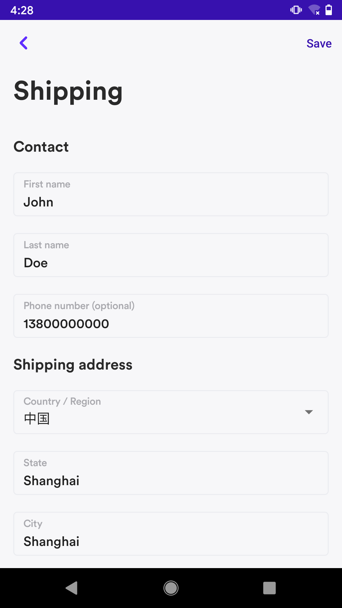
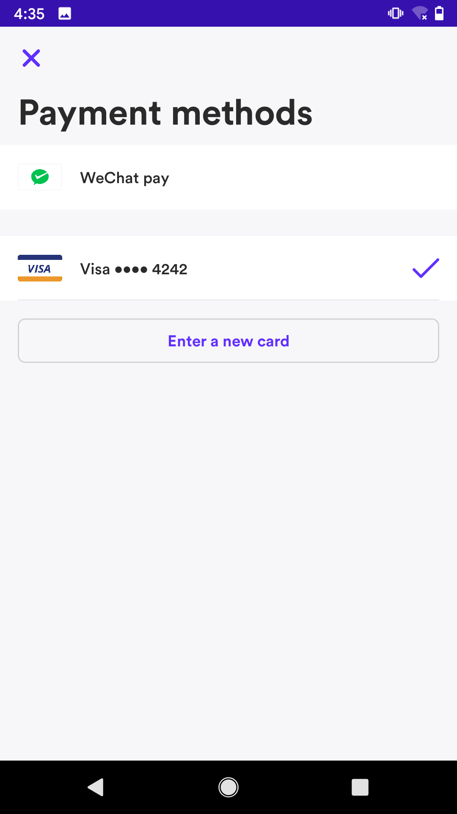
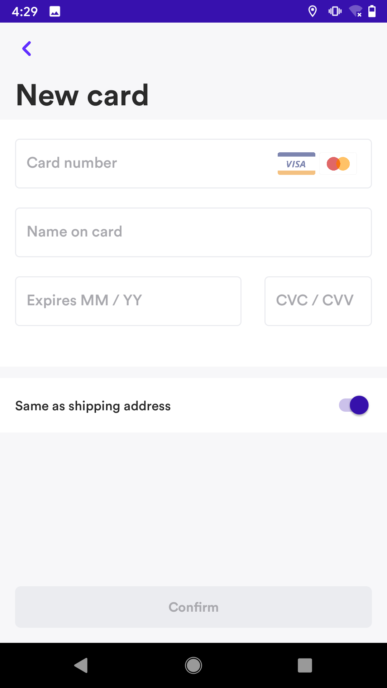
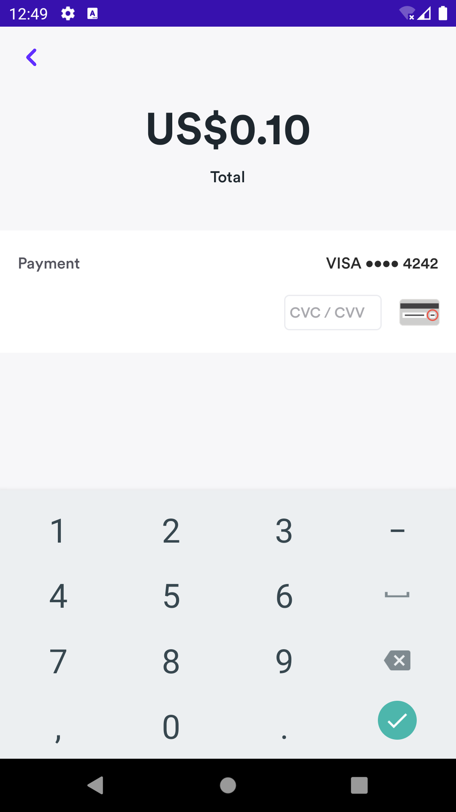

# Airwallex Android SDK
Airwallex Android SDK是一种灵活的工具，可让您将付款方式集成到您的Android App中。 它还包括一个预构建的UI，使您可以灵活地选择使用其中的任何部分，同时用自己的UI替换其余部分。

本节将指导您完成集成Airwallex Android SDK的过程。 我们假设您是一名Android开发人员，并且熟悉Android Studio和Gradle。

要使用Airwallex Android SDK接受在线支付，请先完成准备工作，然后根据需要选择集成选项。

*准备*
1. [准备集成](#准备集成) SDK之前, 您需要配置SDK，并在服务端创建PaymentIntent

*集成选项*
1. [UI集成](#UI集成)你可以使用我们SDK提供的已构建好的用户UI, 这是**推荐用法**。
2. [低层API集成](#低层API集成)你可以构建你自定义的UI，并使用我们的低层API。

我们的Demo开源在 [Github](https://github.com/airwallex/airwallex-payment-android)，可以帮助你更好地了解如何在你的Android项目中集成Airwallex Android SDK。

## Contents
* [Overview](#Overview)
    * [Airwallex API](#airwallex-api)
    * [Airwallex Native UI](#airwallex-native-ui)
* [准备集成](#准备集成)
    * [添加依赖](#添加依赖)
    * [配置SDK](#配置SDK)
        * [初始化SDK](#初始化SDK)
        * [创建PaymentIntent](#创建PaymentIntent)
* [UI集成](#UI集成)
    * [Edit Shipping Info](#edit-shipping-info)
    * [Use the entire Native UI in one flow](#use-the-entire-native-ui-in-one-flow)
    * [Set up Google Pay](#set-up-google-pay)
    * [Custom Theme](#custom-theme)
* [低层API集成](#低层API集成)
    * [用卡和账单详情或者consent ID来确认卡支付](#用卡和账单详情或者consent-id来确认卡支付)
* [SDK Example](#sdk-example)
* [测试卡号](#测试卡号)
* [贡献](#贡献)

## Overview

### Airwallex API

Airwallex Android SDK是一种灵活的工具，可让您将付款方式集成到您的Android App中。

注意：Airwallex Android SDK与支持Android API级别19及更高版本的应用程序兼容，SDK文件大小约为3188.04KB

支持的付款方式：
- Cards: [`Visa, Mastercard`](#cards). If you want to integrate Airwallex API without our Native UI for card payments, then your website is required to be PCI-DSS compliant. 
- E-Wallets: [`Alipay`](#alipay), [`AlipayHK`](#alipayhk), [`DANA`](#dana), [`GCash`](#gcash), [`Kakao Pay`](#kakao-pay), [`Touch ‘n Go`](#touch-n-go), [`WeChat Pay`](#wechat-pay)

### Airwallex Native UI
Airwallex Native UI 是一个预构建的UI，可让您自定义UI颜色并适合您的App主题。 您可以单独使用这些组件，也可以将我们的预构建UI打包到一个流程中以显示您的付款。
|#|Native UI|Picture|
|---|---|----
|1|[`Edit shipping info page`](#edit-shipping-info)<br/>此页面包含供购物者填写的详细运输表单，在购物者成功保存表单后，将返回运输信息对象|<p align="center"></p>
|2|[`Select payment method page`](#selecting-payment-method-page)<br/>此页面将显示购物者所有可用的付款方式，购物者可以选择其中一种进行支付|<p align="center"></p>
|3|[`Input card information module`](#input-card-information-module)<br/>该模块包含卡号，有效期和cvc。|<p align="center"></p>
|4|[`Confirm payment intent page`](#confirm-payment-intent-page)<br/>您需要传入PaymentIntent对象和PaymentMethod对象。 它将显示当前选定的付款金额，封装付款的特定操作，并通过回调方法返回PaymentIntent或Exception|<p align="center"></p>

## 准备集成

### 添加依赖
Airwallex Android SDK 支持Android API 19及以上版本。

- 安装SDK
已经上传到[Maven Central](https://repo1.maven.org/maven2/io/github/airwallex/), 你只需要添加Gradle依赖项。

在项目的根目录下，打开`build.gradle`，并添加以下内容：

```groovy
    dependencies {
        // It's required
        implementation 'io.github.airwallex:payment:4.4.7'
        
        // Select the payment method you want to support.
        implementation 'io.github.airwallex:payment-card:4.4.7'
        implementation 'io.github.airwallex:payment-redirect:4.4.7'
        implementation 'io.github.airwallex:payment-wechat:4.4.7'
        implementation 'io.github.airwallex:payment-googlepay:4.4.7'
    }
```

### 配置SDK
设置SDK后，需要使用一些参数来配置SDK。 在使用Airwallex SDK confirm PaymentIntent并完成付款之前，您应在自己的服务器中创建PaymentIntent，以确保在自己的系统中维护信息
#### 初始化SDK

我们提供了一些可用于调试SDK的参数，你可以在Application中调用
```kotlin
    Airwallex.initialize(
        AirwallexConfiguration.Builder()
            .enableLogging(true)                // Enable log in sdk, and don’t forogt to set to false when it is ready to release
            .setEnvironment(Environment.DEMO)   // You can change the environment to STAGING, DEMO or PRODUCTION. It must be set to PRODUCTION when it is ready to release.
            .setSupportComponentProviders(
                listOf(
                    CardComponent.PROVIDER,
                    WeChatComponent.PROVIDER,
                    RedirectComponent.PROVIDER,
                    GooglePayComponent.PROVIDER
                )
            )
            .build(),
        ExampleClientSecretProvider()           // If you need to support recurring, you must to support your custom ClientSecretProvider
    )
```

#### 创建PaymentIntent

在confirm`PaymentIntent`之前, 你必须在服务端创建一个`PaymentIntent`对象，并返回到客户端.

> 请按照以下步骤在商家服务器上创建PaymentIntent
>1. 首先，您需要获取访问令牌以允许您访问Airwallex API端点。 使用您的唯一Client ID 和 API KEY (这些可以在 [Account settings > API keys](https://www.airwallex.com/app/settings/api) 中生成). 成功之后，你可以得到一个access token。
>
>2. 创建 customer(可选的) 允许您保存customer的详细信息, 可以在customer上绑定付款方式，以便在customer在支付时快速检索支持的付款方式 [`/api/v1/pa/customers/create`](https://www.airwallex.com/docs/api#/Payment_Acceptance/Customers/_api_v1_pa_customers_create/post)
>
>3. 最终, 你可以通过 [`/api/v1/pa/payment_intents/create`](https://www.airwallex.com/docs/api#/Payment_Acceptance/Payment_Intents/_api_v1_pa_payment_intents_create/post) 来创建一个`PaymentIntent`对象，然后返回到你的客户端
>
>4. 在返回结果中，将包含client_secret，您需要将其存储以备后用。 

创建付款意向后，您可以使用Airwallex SDK confirm PaymentIntent，并使购物者能够使用选定的付款方式完成付款

下一步:
- 集成AirwallexUI，以向购物者显示付款流程。
- 如果您不想使用预构建的UI，则可以选择使用自己的UI页面。 然后，您可以集成不同的支付方式

## UI集成
我们提供一些UI组件，以加快付款功能的集成。
首先，在你的Activity或Fragment中，重写 Activity#onActivityResult 方法，并调用AirwallexStarter.handlePaymentData方法。
```kotlin
    override fun onActivityResult(requestCode: Int, resultCode: Int, data: Intent?) {
        super.onActivityResult(requestCode, resultCode, data)
        
        // You must call this method on `onActivityResult`
        AirwallexStarter.handlePaymentData(requestCode, resultCode, data)

        // Note: If you are integrating by low-level API, you should call the following instead of the above method
        // airwallex.handlePaymentData(requestCode, resultCode, data)
    }
```

### Edit shipping info
使用 `presentShippingFlow` 允许用户提供送货地址以及选择送货方式. `shipping` 字段是可选的
```kotlin
    AirwallexStarter.presentShippingFlow(this, shipping,
        object : Airwallex.ShippingResultListener {
            override fun onCompleted(status: AirwallexShippingStatus) {
                
            }
        }
    )
```

### Use the entire Native UI in one flow
- 对于需要重定向的支付方式，你需要在`AndroidManifest.xml`配置scheme url
```
    <intent-filter>
        ...
        <data
            android:host="${applicationId}"
            android:scheme="airwallexcheckout" />
    </intent-filter>
```

- 使用 `presentPaymentFlow` 来完成整个支付流程. 需要传入一个 `AirwallexSession`对象
```kotlin
    private fun buildSession(
        paymentIntent: PaymentIntent? = null,
        customerId: String? = null
    ): AirwallexSession {
        return when (checkoutMode) {
            AirwallexCheckoutMode.PAYMENT -> {
                AirwallexPaymentSession.Builder(
                    paymentIntent = requireNotNull(
                        paymentIntent,
                        { "PaymentIntent is required" }
                    ),
                    countryCode = Settings.countryCode,
                    googlePayOptions = GooglePayOptions(
                        billingAddressRequired = true,
                        billingAddressParameters = BillingAddressParameters(BillingAddressParameters.Format.FULL)
                    )
                )
                    .setReturnUrl(Settings.returnUrl)
                    .build()
            }
            AirwallexCheckoutMode.RECURRING -> {
                AirwallexRecurringSession.Builder(
                    customerId = requireNotNull(customerId, { "CustomerId is required" }),
                    currency = Settings.currency,
                    amount = BigDecimal.valueOf(Settings.price.toDouble()),
                    nextTriggerBy = nextTriggerBy,
                    countryCode = Settings.countryCode
                )
                    .setShipping(shipping)
                    .setRequireCvc(requiresCVC)
                    .setMerchantTriggerReason(if (nextTriggerBy == PaymentConsent.NextTriggeredBy.MERCHANT) PaymentConsent.MerchantTriggerReason.SCHEDULED else PaymentConsent.MerchantTriggerReason.UNSCHEDULED)
                    .setReturnUrl(Settings.returnUrl)
                    .build()
            }
            AirwallexCheckoutMode.RECURRING_WITH_INTENT -> {
                AirwallexRecurringWithIntentSession.Builder(
                    paymentIntent = requireNotNull(
                        paymentIntent,
                        { "PaymentIntent is required" }
                    ),
                    customerId = requireNotNull(
                        paymentIntent.customerId,
                        { "CustomerId is required" }
                    ),
                    nextTriggerBy = nextTriggerBy,
                    countryCode = Settings.countryCode
                )
                    .setRequireCvc(requiresCVC)
                    .setMerchantTriggerReason(if (nextTriggerBy == PaymentConsent.NextTriggeredBy.MERCHANT) PaymentConsent.MerchantTriggerReason.SCHEDULED else PaymentConsent.MerchantTriggerReason.UNSCHEDULED)
                    .setReturnUrl(Settings.returnUrl)
                    .build()
            }
        }
    }
    val session = buildSession(paymentIntent, customerId)
    AirwallexStarter.presentPaymentFlow(this, session,
        object : Airwallex.PaymentResultListener {
    
            override fun onCompleted(status: AirwallexPaymentStatus) {
    
            }
        }
    )
```
- 获取支付结果, 你可以通过调用 `retrievePaymentIntent` 方法检查最新的状态，并提供用户结果
```
    airwallex.retrievePaymentIntent(
        params = RetrievePaymentIntentParams(
            // the ID of the `PaymentIntent`, required.
            paymentIntentId = paymentIntentId,
            // the clientSecret of `PaymentIntent`, required.
            clientSecret = clientSecret
        ),
        listener = object : Airwallex.PaymentListener<PaymentIntent> {
            override fun onSuccess(response: PaymentIntent) {
                onComplete.invoke(response)
            }

            override fun onFailed(exception: AirwallexException) {
                Log.e(TAG, "Retrieve PaymentIntent failed", exception)
            }
        }
    )
```

### Set up Google Pay
Airwallex Android SDK可以通过以下步骤允许商户给顾客提供Google Pay作为支付方式：
- 确认Google Pay在您的Airwallex账号上已开通
- 根据[添加依赖](#添加依赖)在安装SDK时添加Google Pay模块
- 您可以自定义Google Pay选项来限制或提供额外的付款参数。请参考`GooglePayOptions`类中的更多信息。
```
val googlePayOptions = GooglePayOptions(
        allowedCardAuthMethods = listOf("CRYPTOGRAM_3DS"),
        billingAddressParameters = BillingAddressParameters(BillingAddressParameters.Format.FULL),
        shippingAddressParameters = ShippingAddressParameters(listOf("AU", "CN"), true)
    )
val paymentSession = AirwallexPaymentSession.Builder(
        paymentIntent = ...,
        countryCode = ...,
        googlePayOptions = googlePayOptions
    )
```
- 我们现在暂时只支持Visa和MasterCard来进行Google Pay支付，用户在通过Google Pay付款时只能选择这两种卡。
> 请注意我们的Google Pay模块目前只支持`AirwallexPaymentSession`。我们会在以后添加对recurring payment sessions的支持。

### Custom Theme
您可以在应用程序中覆盖这些颜色值, 用来适配您的应用风格。 https://developer.android.com/guide/topics/ui/look-and-feel/themes#CustomizeTheme
```
    <color name="airwallex_tint_color">@color/airwallex_color_red</color>
```

## 低层API集成
你可以基于我们的低层API来构建完全由你自定义的UI。

### 用卡和账单详情或者consent ID来确认卡支付
```kotlin
val session = buildSession(paymentIntent, customerId)
val airwallex = Airwallex(this@PaymentCartFragment)

// Confirm intent with card and billing
airwallex.confirmPaymentIntent(
    session = session,
    card = PaymentMethod.Card.Builder()
        .setNumber("4012000300000021")
        .setName("John Citizen")
        .setExpiryMonth("12")
        .setExpiryYear("2029")
        .setCvc("737")
        .build(),
    billing = null,
    listener = object : Airwallex.PaymentResultListener {
        override fun onCompleted(status: AirwallexPaymentStatus) {
            // You can handle different payment statuses and perform UI action respectively here
        }
    }
)

// Or to confirm intent with a valid payment consent ID
airwallex.confirmPaymentIntent(
    session = session,
    paymentConsentId = "cst_xxxxxxxxxx",
    listener = object : Airwallex.PaymentResultListener {
        override fun onCompleted(status: AirwallexPaymentStatus) {
            // You can handle different payment statuses and perform UI action respectively here
        }
    }
)
```

### 通过Google Pay来发起支付
```kotlin
// 注意：我们目前仅支持AirwallexPaymentSession（一次性付款），暂不支持对于Google Pay的recurring session。
// Also make sure you pass GooglePayOptions to the session.
val session = buildSession(paymentIntent)
val airwallex = Airwallex(this@PaymentCartFragment)

airwallex.startGooglePay(
    session = session,
    listener = object : Airwallex.PaymentResultListener {
        override fun onCompleted(status: AirwallexPaymentStatus) {
            // You can handle different payment statuses and perform UI action respectively here
        }
    }
)
```

## SDK Example
该示例应用程序演示了如何使用其内置的UI组件与Airwallex Android SDK集成，以管理结帐流程，包括指定送货地址和选择付款方式。

请按照以下步骤运行我们的`sample`

1. 使用以下命令clone代码到本地
`git clone git@github.com:airwallex/airwallex-payment-android.git`

2. 打开Android Studio并选择`build.gradle`文件来导入项目

3. 打开 [Airwallex Account settings > API keys](https://www.airwallex.com/app/settings/api), 并拷贝 `Client ID` 和` API key` 到  [`Settings.kt`](https://github.com/airwallex/airwallex-payment-android/blob/master/sample/src/main/java/com/airwallex/paymentacceptance/Settings.kt)
```
    private const val BASE_URL = replace_with_base_url
    private const val API_KEY = replace_with_api_key
    private const val CLIENT_ID = replace_with_client_id
```

4. 在 [WeChat Pay](https://pay.weixin.qq.com/index.php/public/wechatpay), 注册app, 然后拷贝 `App ID` 到 [`Settings.kt`](https://github.com/airwallex/airwallex-payment-android/blob/master/sample/src/main/java/com/airwallex/paymentacceptance/Settings.kt)
```
    private const val WECHAT_APP_ID = "put your WeChat app id here"
```

5. 运行`sample`工程

## 测试卡号
https://cardinaldocs.atlassian.net/wiki/spaces/CCen/pages/903577725/EMV+3DS+Test+Cases

## 贡献
我们欢迎任何形式的贡献，包括新功能，错误修复和文档改进。最简单的方式就是创建pull request - 我们会尽快回复。 如果你发现任何错误或有任何疑问，也可以提交Issues。
