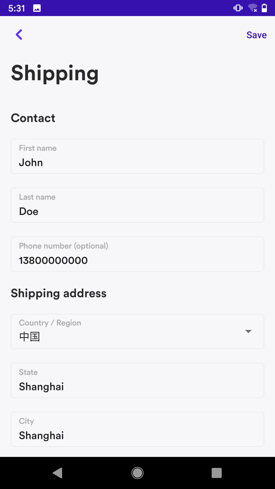

# Airwallex Android SDK
Airwallex Android SDK是一种灵活的工具，可让您将付款方式集成到您的Android App中。 它还包括一个预构建的UI，使您可以灵活地选择使用其中的任何部分，同时用自己的UI替换其余部分。

本节将指导您完成集成Airwallex Android SDK的过程。 我们假设您是一名Android开发人员，并且熟悉Android Studio和Gradle。

要使用Airwallex Android SDK接受在线支付，请先完成准备工作，然后根据需要选择集成选项。

*准备*
1. [准备集成](#准备集成) SDK之前, 您需要配置SDK，并在服务端创建PaymentIntent

*集成选项*
1. [Airwallex API Integration](#airwallex-api-integration)If you prefer to use your own payment UI, you can choose to integrate Airwallex Android SDK via API.
2. [Airwallex Native UI integration](#airwallex-native-ui-integration)You can choose to use Airwallex Android SDK with our prebuilt UI page

我们的Demo开源在 [Github](https://github.com/airwallex/airwallex-payment-android)，可以帮助你更好地了解如何在你的Android项目中集成Airwallex Android SDK。

## Contents
* [Overview](#Overview)
    * [Airwallex API](#airwallex-api)
    * [Airwallex Native UI](#airwallex-native-ui)
* [准备集成](#准备集成)
    * [添加依赖](#添加依赖)
    * [配置SDK](#配置SDK)
        * [初始化SDK](#初始化SDK)
        * [创建PaymentIntent](#创建PaymentIntent)
* [UI集成](#UI集成)
    * [Edit Shipping Info](#edit-shipping-info)
    * [Use the entire Native UI in one flow](#use-the-entire-native-ui-in-one-flow)
    * [Custom Theme](#custom-theme)
* [API集成](#API集成)
    * [Cards](#cards)
    * [Alipay, AlipayHK, DANA, GCash, Kakao Pay, Touch ‘n Go](#alipay-alipayhk-dana-gcash-kakao-pay-touch-n-go)
    * [WeChat](#wechat)
* [SDK Example](#sdk-example)
* [测试卡号](#测试卡号)
* [贡献](#贡献)

## Overview

### Airwallex API

Airwallex Android SDK是一种灵活的工具，可让您将付款方式集成到您的Android App中。

注意：Airwallex Android SDK与支持Android API级别19及更高版本的应用程序兼容，SDK文件大小约为3188.04KB

支持的付款方式：
- Cards: [`Visa, Mastercard`](#cards). If you want to integrate Airwallex API without our Native UI for card payments, then your website is required to be PCI-DSS compliant. 
- E-Wallets: [`Alipay`](#alipay), [`AlipayHK`](#alipayhk), [`DANA`](#dana), [`GCash`](#gcash), [`Kakao Pay`](#kakao-pay), [`Touch ‘n Go`](#touch-n-go), [`WeChat Pay`](#wechat-pay)

### Airwallex Native UI
Airwallex Native UI 是一个预构建的UI，可让您自定义UI颜色并适合您的App主题。 您可以单独使用这些组件，也可以将我们的预构建UI打包到一个流程中以显示您的付款。
|#|Native UI|Picture|
|---|---|----
|1|[`Edit shipping info page`](#edit-shipping-info)<br/>此页面包含供购物者填写的详细运输表单，在购物者成功保存表单后，将返回运输信息对象|<p align="center"></p>
|2|[`Select payment method page`](#selecting-payment-method-page)<br/>此页面将显示购物者所有可用的付款方式，购物者可以选择其中一种进行支付|<p align="center"></p>
|3|[`Input card information module`](#input-card-information-module)<br/>该模块包含卡号，有效期和cvc。|<p align="center"></p>
|4|[`Confirm payment intent page`](#confirm-payment-intent-page)<br/>您需要传入PaymentIntent对象和PaymentMethod对象。 它将显示当前选定的付款金额，封装付款的特定操作，并通过回调方法返回PaymentIntent或Exception|<p align="center"></p>

## 准备集成

### 添加依赖
Airwallex Android SDK 支持Android API 19及以上版本。

- 安装SDK
已经上传到[Maven Central](https://repo1.maven.org/maven2/io/github/airwallex/), 你只需要添加Gradle依赖项。

在项目的根目录下，打开`build.gradle`，并添加以下内容：

```groovy
    dependencies {
        implementation 'io.github.airwallex:airwallex-core:2.0.6'
    }
```

### 配置SDK
设置SDK后，需要使用一些参数来配置SDK。 在使用Airwallex SDK confirm PaymentIntent并完成付款之前，您应在自己的服务器中创建PaymentIntent，以确保在自己的系统中维护信息
#### 初始化SDK

我们提供了一些可用于调试SDK的参数，最好在Application中调用
```groovy
    Airwallex.initialize(
        AirwallexConfiguration.Builder()
            .enableLogging(true)                // Enable log in sdk, and don’t forogt to set to false when it is ready to release
            .setEnvironment(Environment.DEMO)   // You can change the environment to STAGING, DEMO or PRODUCTION. It must be set to PRODUCTION when it is ready to release.
            .build()
    )
```

#### 创建PaymentIntent

在confirm`PaymentIntent`之前, 你必须在服务端创建一个`PaymentIntent`对象，并返回到客户端.

> 请按照以下步骤在商家服务器上创建PaymentIntent
>1. 首先，您需要获取访问令牌以允许您访问Airwallex API端点。 使用您的唯一Client ID 和 API KEY (这些可以在 [Account settings > API keys](https://www.airwallex.com/app/settings/api) 中生成). 成功之后，你可以得到一个access token。
>
>2. 创建 customer(可选的) 允许您保存customer的详细信息, 可以在customer上绑定付款方式，以便在customer在支付时快速检索支持的付款方式 [`/api/v1/pa/customers/create`](https://www.airwallex.com/docs/api#/Payment_Acceptance/Customers/_api_v1_pa_customers_create/post)
>
>3. 最终, 你可以通过 [`/api/v1/pa/payment_intents/create`](https://www.airwallex.com/docs/api#/Payment_Acceptance/Payment_Intents/_api_v1_pa_payment_intents_create/post) 来创建一个`PaymentIntent`对象，然后返回到你的客户端
>
>4. 在返回结果中，将包含client_secret，您需要将其存储以备后用。 

创建付款意向后，您可以使用Airwallex SDK confirm PaymentIntent，并使购物者能够使用选定的付款方式完成付款

下一步:
- 集成AirwallexUI，以向购物者显示付款流程。
- 如果您不想使用预构建的UI，则可以选择使用自己的UI页面。 然后，您可以集成不同的支付方式

## UI集成
我们提供一些UI组件，以加快付款功能的集成。
您可以单独使用它们，也可以按照“集成”指南将所有预构建的UI放在一个流程中。

### Edit shipping info
使用 `presentShippingFlow` 允许用户提供送货地址以及选择送货方式. `shipping` 字段是可选的
```kotlin
    AirwallexStarter.presentShippingFlow(this, shipping,
        object : Airwallex.PaymentListener<Shipping> {
            override fun onSuccess(shipping: Shipping) {
                Log.d(TAG, "Save the shipping success")
            }

            override fun onFailed(exception: Exception) {
                Log.d(TAG, "Save the shipping failed")
            }

            override fun onCancelled() {
                Log.d(TAG, "User cancel edit shipping")
            }
        })
```

### Use the entire Native UI in one flow
使用 `presentPaymentFlow` 来完成整个支付流程. 需要传入一个 `AirwallexSession`对象
```kotlin
    AirwallexStarter.presentPaymentFlow(this, AirwallexPaymentSession.Builder(paymentIntent).build(),
        object : Airwallex.PaymentIntentListener {
            override fun onSuccess(paymentIntent: PaymentIntent) {
                Log.d(TAG, "Confirm payment intent success")
            }
            
            override fun onFailed(exception: Exception) {
                Log.d(TAG, "Confirm payment intent failed")
            }
                
            override fun onCancelled() {
                Log.d(TAG, "User cancel confirm payment intent")
            }
        })
```
### Custom Theme
您可以在应用程序中覆盖这些颜色值, 用来适配您的应用风格。 https://developer.android.com/guide/topics/ui/look-and-feel/themes#CustomizeTheme
```
    <color name="airwallex_tint_color">@color/airwallex_color_red</color>
```

## API集成

PaymentMethod代表您客户的付款方式。 它们可以与PaymentIntent一起使用以完成付款。

支持的支付方式有: [`Cards`](#cards), [`Alipay`](#alipay), [`AlipayHK`](#alipayhk), [`DANA`](#dana), [`GCash`](#gcash), [`Kakao Pay`](#kakao-pay), [`Touch ‘n Go`](#touch-n-go), [`WeChat Pay`](#wechat-pay). You can choose to integrate with the payment method you need to support and we will display the available payment methods based on the transaction currency. The additional implementation effort for offering a new payment method depends on your type of integration.

### Cards

*前置条件*: 你已经通过 [如何创建PaymentIntent](#创建PaymentIntent)创建了一个PaymentIntent

1. 初始化一个 `Airwallex` 对象, 这个 Airwallex SDK 的入口.

```kotlin
    val airwallex = Airwallex(this)
```

2. 然后你可以通过`checkout`完成支付
```kotlin
    val listener = object : Airwallex.PaymentListener<PaymentIntent> {
        override fun onSuccess(response: PaymentIntent) {
            // Confirm Payment Intent success
        }

        override fun onFailed(exception: Exception) {
            // Confirm Payment Intent failed
        }
    }

    val paymentMethod = PaymentMethod.Builder()
        .setType(PaymentMethodType.CARD)
        .setCard(card)
        .setBilling(billing)
        .build()
    airwallex.checkout(AirwallexPaymentSession.Builder(paymentIntent).build(), paymentMethod, listener)
```

在你的Activity或Fragment中, 重写 Activity#onActivityResult 方法
```kotlin
    override fun onActivityResult(requestCode: Int, resultCode: Int, data: Intent?) {
        super.onActivityResult(requestCode, resultCode, data)
        
        // You must call this method on `onActivityResult`
        airwallex.handlePaymentData(requestCode, resultCode, data)
    }
```
3. 获取支付结果, 你可以通过调用 `retrievePaymentIntent` 方法检查最新的状态，并提供用户结果
```kotlin
    airwallex.retrievePaymentIntent(
        params = RetrievePaymentIntentParams(
            paymentIntentId = paymentIntentId,  // the ID of the `PaymentIntent`, required.
            clientSecret = clientSecret         // the clientSecret of `PaymentIntent`, required.
        ),
        listener = object : Airwallex.PaymentListener<PaymentIntent> {
            override fun onSuccess(response: PaymentIntent) {
                if (response.status == PaymentIntentStatus.SUCCEEDED) {
                   // Payment successful
                }
            }
    
            override fun onFailed(exception: Exception) {
                
            }
        })
```

### Alipay, AlipayHK, DANA, GCash, Kakao Pay, Touch ‘n Go

*前置条件*: 你已经通过 [如何创建PaymentIntent](#创建PaymentIntent)创建了一个PaymentIntent

*注意*:
为了支付完成之后跳转到app，需要在创建PaymentIntent时需要传入returnUrl。
```kotlin
    api.createPaymentIntent(
        mutableMapOf(
                
            // The HTTP request method that you should use. After the shopper completes the payment, they will be redirected back to your return_url.
            "return_url" to "$airwallexcheckout://$packageName"
        )
    )
```

1. 初始化一个 `Airwallex` 对象, 这个 Airwallex SDK 的入口.

```kotlin
    val airwallex = Airwallex(this)
```

2. 在AndroidManifest添加以下信息，用户在支付成功之后返回app
```xml
    <activity android:name="...">
        <intent-filter>

            <data
                android:host="${applicationId}"
                android:scheme="${checkoutRedirectScheme}" />
        </intent-filter>
    </activity>
```

3. 通过`checkout`完成支付
```kotlin
    val listener = object : Airwallex.PaymentListener<PaymentIntent> {
        override fun onNextActionWithRedirectUrl(url: String) {
            Logger.debug("Start RedirectUrl $url")
        }
    
        override fun onFailed(exception: Exception) {
            // Confirm Payment Intent failed
        }
    }

    airwallex.checkout(session = AirwallexPaymentSession.Builder(paymentIntent).build(), paymentMethod = PaymentMethod.Builder().setType(PaymentMethodType.ALIPAY_CN).build(), listener = listener)
```

在你的Activity或Fragment中, 重写 Activity#onActivityResult 方法
```kotlin
    override fun onActivityResult(requestCode: Int, resultCode: Int, data: Intent?) {
        super.onActivityResult(requestCode, resultCode, data)
        
        // You must call this method on `onActivityResult`
        airwallex.handlePaymentData(requestCode, resultCode, data)
    }
```

4. 您需要使用RedirectUtil.makeRedirect来跳转到购物者的电子钱包应用中完成付款。
```kotlin
    try { 
        RedirectUtil.makeRedirect(activity = requireActivity(), redirectUrl = redirectUrl)
    } catch (e: RedirectException) {
        showPaymentError(e.localizedMessage)
    }
```


5. 获取支付结果, 你可以通过调用 `retrievePaymentIntent` 方法检查最新的状态，并提供用户结果
```kotlin
    airwallex.retrievePaymentIntent(
        params = RetrievePaymentIntentParams(
            paymentIntentId = paymentIntentId,  // the ID of the `PaymentIntent`, required.
            clientSecret = clientSecret         // the clientSecret of `PaymentIntent`, required.
        ),
        listener = object : Airwallex.PaymentListener<PaymentIntent> {
            override fun onSuccess(response: PaymentIntent) {
                if (response.status == PaymentIntentStatus.SUCCEEDED) {
                   // Payment successful
                }
            }
    
            override fun onFailed(exception: Exception) {
                
            }
        })
```

### WeChat

*前置条件*: 你已经通过 [如何创建PaymentIntent](#创建PaymentIntent)创建了一个PaymentIntent
- 你已经通过 [如何创建PaymentIntent](#创建PaymentIntent)创建了一个PaymentIntent
- 在 [WeChat Pay](https://open.weixin.qq.com/) 注册app， 将为商家提供唯一的APP_ID。 然后，请与我们联系，我们将在Airwallex仪表板中注册您的微信APPID。

1. 初始化一个 `Airwallex` 对象, 这个 Airwallex SDK 的入口.

```kotlin
    val airwallex = Airwallex(this)
```

2. 完成checkout，你需要调用 `checkout` 方法. 
```kotlin
    val listener = object : Airwallex.PaymentListener<PaymentIntent> {
        override fun onNextActionWithWeChatPay(weChat: WeChat) {
            Logger.debug("Start WeChat Pay $weChat")
        }
    
        override fun onFailed(exception: Exception) {
            // Confirm Payment Intent failed
        }
    }

    airwallex.checkout(session = AirwallexPaymentSession.Builder(paymentIntent).build(), paymentMethod = PaymentMethod.Builder().setType(PaymentMethodType.WECHAT).build(), listener = listener)
```

在你的Activity或Fragment中, 重写 Activity#onActivityResult 方法
```kotlin
    override fun onActivityResult(requestCode: Int, resultCode: Int, data: Intent?) {
        super.onActivityResult(requestCode, resultCode, data)
        
        // You must call this method on `onActivityResult`
        airwallex.handlePaymentData(requestCode, resultCode, data)
    }
```

3. 成功确认付款意向后，Airwallex将返回微信支付所需的所有参数。 你需要调用 [WeChat Pay SDK](https://pay.weixin.qq.com/wiki/doc/api/wxpay/pay/In-AppPay/chapter6_2.shtml) 完成最终支付
Check the [WeChat Pay Sample](https://github.com/airwallex/airwallex-payment-android/tree/master) for more details.

```kotlin
    val weChatReq = PayReq()
    weChatReq.appId = weChat.appId
    weChatReq.partnerId = weChat.partnerId
    weChatReq.prepayId = weChat.prepayId
    weChatReq.packageValue = weChat.`package`
    weChatReq.nonceStr = weChat.nonceStr
    weChatReq.timeStamp = weChat.timestamp
    weChatReq.sign = weChat.sign
     
    val weChatApi = WXAPIFactory.createWXAPI(applicationContext, appId)
    weChatApi.sendReq(weChatReq)
```
4. 付款完成后，您可以使用onResp（）方法将购物者重定向回您的应用，可以检查最终付款状态。
```kotlin
    override fun onResp(resp: BaseResp?) {
        if (resp is PayResp) {
            when (resp.errCode) {
                BaseResp.ErrCode.ERR_OK -> listener?.onSuccess()
                BaseResp.ErrCode.ERR_COMM -> listener?.onFailure(errCode.toString(), errText)
                BaseResp.ErrCode.ERR_USER_CANCEL -> listener?.onCancel()
                else -> listener?.onFailure(errCode.toString(), errText)
            }

        }
    }
```

5. 获取支付结果, 你可以通过调用 `retrievePaymentIntent` 方法检查最新的状态，并提供用户结果
```kotlin
    airwallex.retrievePaymentIntent(
        params = RetrievePaymentIntentParams(
            paymentIntentId = paymentIntentId,  // the ID of the `PaymentIntent`, required.
            clientSecret = clientSecret         // the clientSecret of `PaymentIntent`, required.
        ),
        listener = object : Airwallex.PaymentListener<PaymentIntent> {
            override fun onSuccess(response: PaymentIntent) {
                if (response.status == PaymentIntentStatus.SUCCEEDED) {
                   // Payment successful
                }
            }
    
            override fun onFailed(exception: Exception) {
                
            }
        })
```

## SDK Example
该示例应用程序演示了如何使用其内置的UI组件与Airwallex Android SDK集成，以管理结帐流程，包括指定送货地址和选择付款方式。

请按照以下步骤运行我们的`sample`

1. 使用以下命令clone代码到本地
`git clone git@github.com:airwallex/airwallex-payment-android.git`

2. 打开Android Studio并选择`build.gradle`文件来导入项目

3. 打开 [Airwallex Account settings > API keys](https://www.airwallex.com/app/settings/api), 并拷贝 `Client ID` 和` API key` 到  [`Settings.kt`](https://github.com/airwallex/airwallex-payment-android/blob/master/sample/src/main/java/com/airwallex/paymentacceptance/Settings.kt)
```
    private const val BASE_URL = "put your base url here"
    private const val API_KEY = "put your api key here"
    private const val CLIENT_ID = "put your client id here"
```

4. 在 [WeChat Pay](https://pay.weixin.qq.com/index.php/public/wechatpay), 注册app, 然后拷贝 `App ID` 到 [`Settings.kt`](https://github.com/airwallex/airwallex-payment-android/blob/master/sample/src/main/java/com/airwallex/paymentacceptance/Settings.kt)
```
    private const val WECHAT_APP_ID = "put your WeChat app id here"
```

5. 运行`sample`工程

## 测试卡号
https://cardinaldocs.atlassian.net/wiki/spaces/CCen/pages/903577725/EMV+3DS+Test+Cases

## 贡献
我们欢迎任何形式的贡献，包括新功能，错误修复和文档改进。最简单的方式就是创建pull request - 我们会尽快回复。 如果你发现任何错误或有任何疑问，也可以提交Issues。
