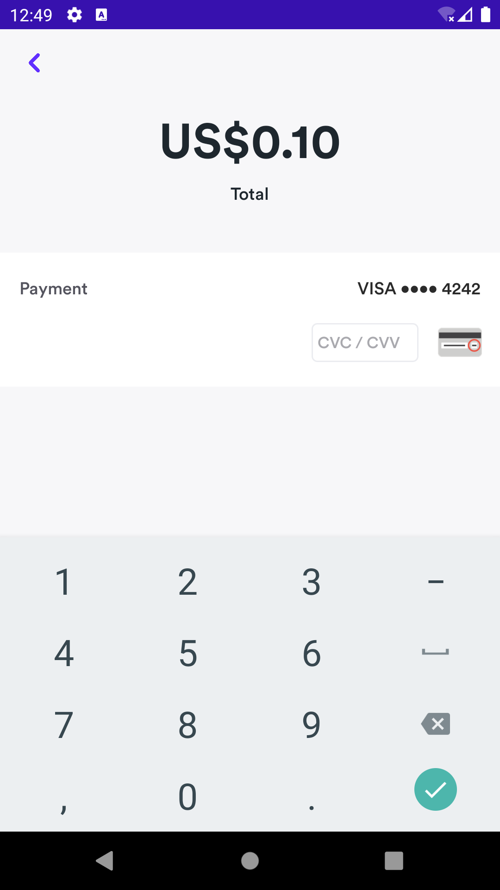

# Contents
* [Overview](#overview)
    * [Supported Payment Methods](#supported-payment-methods)
    * [Integration Options](#integration-options)
    * [Platform Requirements](#platform-requirements)
    * [Native UI Components](#native-ui-components)
* [Before you start](#before-you-start)
* [Airwallex Native UI integration](#airwallex-native-ui-integration)
    * [Requirements](#requirements)
    * [Installation](#installation)
    * [SDK Configuration](#sdk-configuration)
    * [Customization](#customization)
    * [Payment Flow](#payment-flow)
    * [Google Pay Integration](#google-pay-integration)
* [Embedded Element Integration](#embedded-element-integration)
    * [Overview](#embedded-overview)
    * [Requirements](#embedded-requirements)
    * [Installation](#embedded-installation)
    * [Create PaymentElement](#create-paymentelement)
    * [Configuration Options](#configuration-options)
    * [Kotlin Example](#kotlin-example)
    * [Java Example](#java-example)
* [Low-level API Integration](#low-level-api-integration)
    * [Step 1: Set up SDK](#step-1-set-up-sdk)
    * [Step 2: Configuration and preparation](#step-2-configuration-and-preparation)
    * [Step 3: Create AirwallexSession and Airwallex object](#step-3-create-airwallexsession-and-airwallex-object)
    * [Confirm payment with card and billing details](#confirm-payment-with-card-and-billing-details)
    * [Confirm payment with Consent ID](#confirm-payment-with-consent-id)
    * [Confirm payment with PaymentConsent](#confirm-payment-with-paymentconsent)
    * [Retrieve the list of payment methods](#retrieve-the-list-of-payment-methods)
    * [Retrieve the list of saved cards](#retrieve-the-list-of-saved-cards)
    * [Launch payment via Google Pay](#launch-payment-via-google-pay)
    * [Pay by redirection](#pay-by-redirection)
* [SDK Example](#sdk-example)
* [Test Card Numbers](#test-card-numbers)
* [Contributing](#contributing)

# Overview

The Airwallex Android SDK provides a comprehensive toolkit for integrating payment functionality into your Android application. It offers prebuilt UI components for rapid integration, embeddable elements for a customized look, and low-level APIs for full control over the payment experience.

This guide covers SDK setup, configuration, and integration. It assumes familiarity with Android development, Android Studio, and Gradle.

## Supported Payment Methods

| Category | Methods | Notes |
|----------|---------|-------|
| Cards | [`Visa, Mastercard, UnionPay, Discover, JCB, Diners Club`](#cards) | PCI-DSS compliance is required when integrating without Native UI |
| E-Wallets | [`Alipay`](#alipay), [`AlipayHK`](#alipayhk), [`DANA`](#dana), [`GCash`](#gcash), [`Kakao Pay`](#kakao-pay), [`Touch ‘n Go`](#touch-n-go), [`WeChat Pay`](#wechat-pay) | |

## Integration Options

Complete the [prerequisites](#before-you-start), then choose the integration approach that best fits your needs:

| Option | Description |
|--------|-------------|
| [Native UI Integration](#airwallex-native-ui-integration) | Prebuilt UI components with customizable theming. **Recommended for most use cases.** |
| [Embedded Element Integration](#embedded-element-integration) | Embed individual payment UI components directly into your own layouts. |
| [Low-level API Integration](#low-level-api-integration) | Build a fully custom UI on top of the Airwallex payment APIs. |

> A fully functional demo application is available on [GitHub](https://github.com/airwallex/airwallex-payment-android).

## Platform Requirements

- Android API level 21 (Lollipop) and above
- Approximate SDK size: ~3.1 MB

## Native UI Components

The Native UI provides prebuilt, themeable screens that can be used individually or composed into a complete payment flow.

| # | Component | Preview |
|---|-----------|---------|
| 1 | [`Edit shipping info page`](#edit-shipping-info)<br/>Collects shipping details from the shopper. Returns a shipping info object upon successful submission. | <p align="center"></p> |
| 2 | [`Select payment method page`](#selecting-payment-method-page)<br/>Displays all available payment methods for the shopper to choose from. | <p align="center"></p> |
| 3 | [`Input card information module`](#input-card-information-module)<br/>Captures card number, expiration date, and CVV. | <p align="center"></p> |
| 4 | [`Confirm payment intent page`](#confirm-payment-intent-page)<br/>Accepts a `PaymentIntent` and `PaymentMethod`, displays the payment summary, and returns the result or error via callback. | <p align="center"></p> |

# Before you start
We offer two methods for integrating Airwallex services. The first method provides pre-built user interfaces that you can directly invoke in your project. The second method provides low-level APIs, which require you to build your own user interfaces. You can choose the integration method based on your needs.

# Airwallex Native UI integration
The Airwallex Android SDK provides native UI components to simplify payment integration in your Android application.

## Requirements
- Android API level 21 and above

## Installation

The Airwallex Android SDK is available through [Maven Central](https://repo1.maven.org/maven2/io/github/airwallex/).

Add the following dependencies to your app-level `build.gradle`:

```groovy
dependencies {
    // Core module (required)
    implementation 'io.github.airwallex:payment:6.4.3'
    
    // Add payment methods you want to support
    implementation 'io.github.airwallex:payment-card:6.4.3'        // Card payments
    implementation 'io.github.airwallex:payment-redirect:6.4.3'    // Redirect-based payments
    implementation 'io.github.airwallex:payment-wechat:6.4.3'      // WeChat Pay
    implementation 'io.github.airwallex:payment-googlepay:6.4.3'   // Google Pay
}
```

## SDK Configuration

Initialize the SDK in your Application class:

```kotlin
import com.airwallex.android.AirwallexStarter
import com.airwallex.android.core.AirwallexConfiguration
import com.airwallex.android.core.Environment
import com.airwallex.android.card.CardComponent
import com.airwallex.android.googlepay.GooglePayComponent
import com.airwallex.android.redirect.RedirectComponent
import com.airwallex.android.wechat.WeChatComponent


AirwallexStarter.initialize(
    application,
    AirwallexConfiguration.Builder()
        .enableLogging(true)                 // Set to false in production
        .saveLogToLocal(false)               // Use your own logging strategy if needed
        .setEnvironment(environment)         // Set the appropriate environment
        .setSupportComponentProviders(
            listOf(
                CardComponent.PROVIDER,
                WeChatComponent.PROVIDER,
                RedirectComponent.PROVIDER,
                GooglePayComponent.PROVIDER
            )
        )
        .build()
)
```

## Customization

You can customize the appearance of the Airwallex SDK UI including theme color and dark mode preferences. This applies to both Native UI integration and Embedded Element integration.

### Theme Color and Dark Mode

Configure the payment UI appearance using `PaymentAppearance`:

**Kotlin:**
```kotlin
import com.airwallex.android.core.AirwallexConfiguration
import com.airwallex.android.core.PaymentAppearance

AirwallexStarter.initialize(
    application,
    AirwallexConfiguration.Builder()
        .enableLogging(true)
        .setEnvironment(environment)
        .setSupportComponentProviders(
            listOf(
                CardComponent.PROVIDER,
                RedirectComponent.PROVIDER,
                GooglePayComponent.PROVIDER
            )
        )
        .setPaymentAppearance(
            PaymentAppearance(
                themeColor = 0xFF612FFF.toInt(),  // Custom theme color (ARGB format)
                isDarkTheme = true                 // Force dark mode (true), light mode (false), or follow system (null)
            )
        )
        .build()
)
```

**Java:**
```java
import com.airwallex.android.core.AirwallexConfiguration;
import com.airwallex.android.core.PaymentAppearance;

AirwallexStarter.initialize(
    application,
    new AirwallexConfiguration.Builder()
        .enableLogging(true)
        .setEnvironment(environment)
        .setSupportComponentProviders(
            Arrays.asList(
                CardComponent.PROVIDER,
                RedirectComponent.PROVIDER,
                GooglePayComponent.PROVIDER
            )
        )
        .setPaymentAppearance(
            new PaymentAppearance(
                0xFF612FFF,  // Custom theme color (ARGB format)
                true         // Force dark mode (true), light mode (false), or follow system (null)
            )
        )
        .build()
);
```

**PaymentAppearance Options:**
- `themeColor`: Custom theme color in ARGB format (e.g., `0xFF612FFF`). If null, uses default Airwallex theme color.
- `isDarkTheme`:
  - `true` - Force dark mode
  - `false` - Force light mode
  - `null` - Follow system dark mode setting (default)

### Legacy Theme Override

You can also override the default theme color using Android's theme system:

```xml
<color name="airwallex_tint_color">@color/your_custom_color</color>
```

Note: The `PaymentAppearance` approach is recommended as it provides more control and applies consistently across all SDK UI components.

## Payment Flow

The Airwallex Android SDK supports two payment flows:

1. **Standard Flow**: Create PaymentIntent on your server before presenting the payment UI. This is the traditional approach where the payment amount and details are known upfront.

2. **Express Checkout**: Provide a `PaymentIntentProvider` or `PaymentIntentSource` that creates the PaymentIntent on demand after collecting payment details from the user. This is useful when:
   - You want to minimize upfront server calls
   - You want to reduce the chance of PaymentIntent expiration by creating it only when the user is actively proceeding with payment
   - You want to avoid creating PaymentIntents for users who abandon the checkout flow early
   - You need real-time validation of inventory or stock availability at the moment of payment

Both flows are fully supported and you can choose the one that best fits your use case.

### 1. Create a Payment Intent (Server-side)

For the **Standard Flow**, you need to create a Payment Intent on your server before presenting the payment UI.

For **Express Checkout**, you'll create the PaymentIntent within your `PaymentIntentProvider` or `PaymentIntentSource` implementation when the SDK requests it.

1. **Obtain an access token**: Generate this using your Client ID and API key from [Account settings > API keys](https://www.airwallex.com/app/settings/api) and call the Authentication API.

2. **Create a customer (optional)**: Use the [`/api/v1/pa/customers/create`](https://www.airwallex.com/docs/api#/Payment_Acceptance/Customers/_api_v1_pa_customers_create/post) endpoint to save customer details.

3. **Create a Payment Intent**: Call [`/api/v1/pa/payment_intents/create`](https://www.airwallex.com/docs/api#/Payment_Acceptance/Payment_Intents/_api_v1_pa_payment_intents_create/post) and get the `client_secret` from the response.

### 2. Create an Airwallex Session

Create an appropriate session object based on your payment scenario. You can choose between two approaches:
- **Standard Flow**: Create PaymentIntent upfront on your server, then pass it to the SDK
- **Express Checkout**: Provide a PaymentIntentProvider to create PaymentIntent on demand after collecting payment details

#### Standard Payment Session

**Standard Flow** (PaymentIntent created upfront):
```kotlin
import com.airwallex.android.core.model.PaymentIntent
import com.airwallex.android.core.AirwallexPaymentSession


// call https://www.airwallex.com/docs/api#/Payment_Acceptance/Payment_Intents/_api_v1_pa_payment_intents_create/post api
// and get intent id, client secret from response.
val paymentIntent = PaymentIntent(
    id = "REPLACE_WITH_YOUR_PAYMENT_INTENT_ID",
    clientSecret = "REPLACE_WITH_YOUR_CLIENT_SECRET",
    amount = 1.toBigDecimal(),
    currency = "USD"
)

val paymentSession = AirwallexPaymentSession.Builder(
    paymentIntent = paymentIntent,
    countryCode = countryCode,
    googlePayOptions = googlePayOptions // Optional
)
    .setRequireBillingInformation(true)
    .setRequireEmail(requireEmail)
    .setReturnUrl(returnUrl)
    .setAutoCapture(autoCapture)
    .setHidePaymentConsents(false)
    .setPaymentMethods(listOf()) // Empty list for all available methods
    .build()
```

**Express Checkout Flow** (PaymentIntent created on demand):
```kotlin
import com.airwallex.android.core.AirwallexPaymentSession
import com.airwallex.android.core.PaymentIntentProvider
import com.airwallex.android.core.PaymentIntentSource


// Option 1: Using PaymentIntentProvider (callback-based, Java-compatible)
class MyPaymentIntentProvider : PaymentIntentProvider {
    override val currency: String = "USD"
    override val amount: BigDecimal = 100.toBigDecimal()

    override fun provide(callback: PaymentIntentProvider.PaymentIntentCallback) {
        // Make API call to create PaymentIntent when needed
        myApiService.createPaymentIntent { result ->
            when (result) {
                is Success -> callback.onSuccess(result.paymentIntent)
                is Error -> callback.onError(result.exception)
            }
        }
    }
}

val provider = MyPaymentIntentProvider()
val session = AirwallexPaymentSession.Builder(
    paymentIntentProvider = provider,
    countryCode = countryCode,
    customerId = customerId, // Optional
    googlePayOptions = googlePayOptions // Optional
)
    .setRequireBillingInformation(true)
    .setRequireEmail(requireEmail)
    .setReturnUrl(returnUrl)
    .setAutoCapture(autoCapture)
    .setHidePaymentConsents(false)
    .setPaymentMethods(listOf())
    .build()


// Option 2: Using PaymentIntentSource (suspend-based, recommended for Kotlin)
class MyPaymentIntentSource : PaymentIntentSource {
    override val currency: String = "USD"
    override val amount: BigDecimal = 100.toBigDecimal()

    override suspend fun getPaymentIntent(): PaymentIntent {
        // Make API call using suspend functions
        return myApiService.createPaymentIntent()
    }
}

val source = MyPaymentIntentSource()
val session = AirwallexPaymentSession.Builder(
    paymentIntentSource = source,
    countryCode = countryCode,
    customerId = customerId, // Optional
    googlePayOptions = googlePayOptions // Optional
)
    .setRequireBillingInformation(true)
    .setRequireEmail(requireEmail)
    .setReturnUrl(returnUrl)
    .setAutoCapture(autoCapture)
    .setHidePaymentConsents(false)
    .setPaymentMethods(listOf())
    .build()
```

#### Recurring Payment Session
```kotlin
import com.airwallex.android.core.AirwallexRecurringSession


val recurringSession = AirwallexRecurringSession.Builder(
    customerId = customerId,
    clientSecret = clientSecret,
    currency = currency,
    amount = amount,
    nextTriggerBy = nextTriggerBy,
    countryCode = countryCode
)
    .setRequireEmail(requireEmail)
    .setShipping(shipping)
    .setRequireCvc(requireCVC)
    .setMerchantTriggerReason(merchantTriggerReason)
    .setReturnUrl(returnUrl)
    .setPaymentMethods(listOf())
    .build()
```

#### Recurring Payment with Intent Session

**Standard Flow** (PaymentIntent created upfront):
```kotlin
import com.airwallex.android.core.AirwallexRecurringWithIntentSession
import com.airwallex.android.core.model.PaymentIntent

val recurringWithIntentSession = AirwallexRecurringWithIntentSession.Builder(
    paymentIntent = paymentIntent,
    customerId = customerId,
    nextTriggerBy = nextTriggerBy,
    countryCode = countryCode
)
    .setRequireEmail(requireEmail)
    .setRequireCvc(requireCVC)
    .setMerchantTriggerReason(merchantTriggerReason)
    .setReturnUrl(returnUrl)
    .setAutoCapture(autoCapture)
    .setPaymentMethods(listOf())
    .build()
```

**Express Checkout Flow** (PaymentIntent created on demand):
```kotlin
import com.airwallex.android.core.AirwallexRecurringWithIntentSession
import com.airwallex.android.core.PaymentIntentProvider
import com.airwallex.android.core.PaymentIntentSource


// Option 1: Using PaymentIntentProvider
val provider = MyPaymentIntentProvider() // Same provider implementation as above
val session = AirwallexRecurringWithIntentSession.Builder(
    paymentIntentProvider = provider,
    customerId = customerId,
    nextTriggerBy = nextTriggerBy,
    countryCode = countryCode
)
    .setRequireEmail(requireEmail)
    .setRequireCvc(requireCVC)
    .setMerchantTriggerReason(merchantTriggerReason)
    .setReturnUrl(returnUrl)
    .setAutoCapture(autoCapture)
    .setPaymentMethods(listOf())
    .build()


// Option 2: Using PaymentIntentSource (recommended for Kotlin)
val source = MyPaymentIntentSource() // Same source implementation as above
val session = AirwallexRecurringWithIntentSession.Builder(
    paymentIntentSource = source,
    customerId = customerId,
    nextTriggerBy = nextTriggerBy,
    countryCode = countryCode
)
    .setRequireEmail(requireEmail)
    .setRequireCvc(requireCVC)
    .setMerchantTriggerReason(merchantTriggerReason)
    .setReturnUrl(returnUrl)
    .setAutoCapture(autoCapture)
    .setPaymentMethods(listOf())
    .build()
```

### 3. Present the Payment UI

#### Complete Payment Flow
```kotlin
import com.airwallex.android.core.Airwallex
import com.airwallex.android.AirwallexStarter
import com.airwallex.android.core.AirwallexPaymentStatus


AirwallexStarter.presentEntirePaymentFlow(
    activity = activity,
    session = session,
    paymentResultListener = object : Airwallex.PaymentResultListener { 
        override fun onCompleted(status: AirwallexPaymentStatus) {
            // Handle the payment result
        }
    }
)
```

#### Card-only Payment Flow
```kotlin
import com.airwallex.android.core.Airwallex
import com.airwallex.android.AirwallexStarter
import com.airwallex.android.core.AirwallexPaymentStatus

AirwallexStarter.presentCardPaymentFlow(
    activity = activity,
    session = session,
    paymentResultListener = object : Airwallex.PaymentResultListener { 
        override fun onCompleted(status: AirwallexPaymentStatus) {
            // Handle the payment result
        }
    }
)
```

#### Card Payment Dialog
```kotlin
import com.airwallex.android.view.AirwallexAddPaymentDialog
import com.airwallex.android.core.Airwallex
import com.airwallex.android.core.AirwallexPaymentStatus


val dialog = AirwallexAddPaymentDialog(
    activity = activity,
    session = session,
    paymentResultListener = object : Airwallex.PaymentResultListener {
        override fun onCompleted(status: AirwallexPaymentStatus) {
            // Handle the payment result
        }
    }
)
dialog.show()
```

### 4. Shipping Information

Allow users to provide shipping details:

```kotlin
import com.airwallex.android.AirwallexStarter
import com.airwallex.android.core.Airwallex

AirwallexStarter.presentShippingFlow(
    activity = activity,
    shipping = shipping, // Optional
    shippingResultListener = object : Airwallex.ShippingResultListener {
        override fun onCompleted(status: AirwallexShippingStatus) {
            // Handle shipping result
        }
    }
)
```

### 5. Verify Payment Status

After payment completion, verify the status:

```kotlin
import com.airwallex.android.core.Airwallex
import com.airwallex.android.core.model.RetrievePaymentIntentParams

airwallex.retrievePaymentIntent(
    params = RetrievePaymentIntentParams(
        paymentIntentId = paymentIntentId,
        clientSecret = clientSecret
    ),
    listener = object : Airwallex.PaymentListener<PaymentIntent> {
        override fun onSuccess(response: PaymentIntent) {
            // Handle successful response
        }

        override fun onFailed(exception: AirwallexException) {
            Log.e(TAG, "Retrieve PaymentIntent failed", exception)
        }
    }
)
```

## Google Pay Integration

### Setup

1. Ensure Google Pay is enabled on your Airwallex account
2. Include the Google Pay module when installing the SDK as per [Installation](#installation)

### Customization

Configure Google Pay options to restrict as well as provide extra context. For more information, please refer to `GooglePayOptions` class:

```kotlin
val googlePayOptions = GooglePayOptions(
    allowedCardAuthMethods = listOf("CRYPTOGRAM_3DS"),
    billingAddressParameters = BillingAddressParameters(BillingAddressParameters.Format.FULL),
    shippingAddressParameters = ShippingAddressParameters(listOf("AU", "CN"), true)
)
```

### Supported Cards

The following card networks are supported for Google Pay:
- AMEX
- DISCOVER
- JCB
- MASTERCARD
- VISA
- MAESTRO (only when `countryCode` is set to `BR`)

## Embedded Element Integration

The Airwallex SDK provides `PaymentElement` - a flexible component that allows you to embed payment UI directly into your own activity or view. This gives you full control over the host UI while leveraging Airwallex's prebuilt payment components.

### <a name="embedded-overview"></a>Overview

Unlike Native UI integration where the SDK launches its own activities (`PaymentMethodsActivity`, `AddPaymentActivity`), Embedded Element integration lets you:
- Embed payment UI in your own activity/view
- Control the surrounding UI and layout
- Customize the container styling
- Integrate seamlessly with your app's navigation flow

Both integration methods support the same customization options via `PaymentAppearance` (theme color and dark mode).

### <a name="embedded-requirements"></a>Requirements

- Android API level 21 and above
- Kotlin Coroutines support (for suspend functions)

### <a name="embedded-installation"></a>Installation

Add the same dependencies as Native UI integration:

```groovy
dependencies {
    // Core module (required)
    implementation 'io.github.airwallex:payment:6.4.2'

    // Add payment methods you want to support
    implementation 'io.github.airwallex:payment-card:6.4.2'
    implementation 'io.github.airwallex:payment-redirect:6.4.2'
    implementation 'io.github.airwallex:payment-wechat:6.4.2'
    implementation 'io.github.airwallex:payment-googlepay:6.4.2'
}
```

Configure the SDK in your Application class (same as Native UI integration - see [SDK Configuration](#sdk-configuration)).

### <a name="create-paymentelement"></a>Create PaymentElement

`PaymentElement.create()` is a suspending function that initializes and fetches required data for the payment UI. You can either use `PaymentFlowlistener` interface or lambda callbacks.

Both variants return `Result<PaymentElement>` which contains either:
- `Success` with the `PaymentElement` instance
- `Failure` with the error

### <a name="configuration-options"></a>Configuration Options

Configure the payment UI using `PaymentElementConfiguration`:

#### 1. Card-only Payment (`PaymentElementConfiguration.Card`)

Shows only card input and saved cards:

```kotlin
import com.airwallex.android.core.AirwallexSupportedCard

// Use default (all supported cards: Visa, Amex, Mastercard, Discover, JCB, Diners Club, UnionPay)
val configuration = PaymentElementConfiguration.Card()

// Or customize supported card brands
val customConfiguration = PaymentElementConfiguration.Card(
    supportedCardBrands = listOf(
        AirwallexSupportedCard.VISA,
        AirwallexSupportedCard.MASTERCARD
    )
)
```

**Note:** By default, `supportedCardBrands` includes all cards from `AirwallexSupportedCard` (Visa, Amex, Mastercard, Discover, JCB, Diners Club, UnionPay). You can customize this list to restrict which card brands to accept.

#### 2. Payment Sheet (`PaymentElementConfiguration.PaymentSheet`)

Shows multiple payment methods with Tab or Accordion layout:

```kotlin
val configuration = PaymentElementConfiguration.PaymentSheet(
    layout = PaymentMethodsLayoutType.TAB,           // TAB or ACCORDION
    showsGooglePayAsPrimaryButton = true             // true: show Google Pay as primary button, false: show in list
)
```

**Layout Options:**
- `PaymentMethodsLayoutType.TAB` - Tab-based layout for payment methods
- `PaymentMethodsLayoutType.ACCORDION` - Accordion-based layout for payment methods

**Google Pay Display:**
- `showsGooglePayAsPrimaryButton = true` - Google Pay appears as a prominent button above other payment methods
- `showsGooglePayAsPrimaryButton = false` - Google Pay appears in the list alongside other payment methods

### <a name="kotlin-example"></a>Kotlin Example

Here's a complete example of embedding the payment element in your own activity:

```kotlin
import android.os.Bundle
import android.view.View
import androidx.activity.ComponentActivity
import androidx.lifecycle.lifecycleScope
import com.airwallex.android.core.Airwallex
import com.airwallex.android.core.AirwallexPaymentSession
import com.airwallex.android.core.AirwallexPaymentStatus
import com.airwallex.android.core.PaymentMethodsLayoutType
import com.airwallex.android.core.model.PaymentIntent
import com.airwallex.android.view.composables.PaymentElement
import com.airwallex.android.view.composables.PaymentElementConfiguration
import com.yourapp.databinding.ActivityCheckoutBinding
import kotlinx.coroutines.launch

class CheckoutActivity : ComponentActivity() {

    private lateinit var binding: ActivityCheckoutBinding
    private val airwallex: Airwallex by lazy { Airwallex(this) }

    override fun onCreate(savedInstanceState: Bundle?) {
        super.onCreate(savedInstanceState)
        binding = ActivityCheckoutBinding.inflate(layoutInflater)
        setContentView(binding.root)

        setupPaymentElement()
    }

    private fun setupPaymentElement() {
        // Show loading indicator
        binding.progressBar.visibility = View.VISIBLE
        binding.composeView.visibility = View.GONE

        lifecycleScope.launch {
            // Create session (see "Create an Airwallex Session" section)
            val paymentIntent = PaymentIntent(
                id = "your_payment_intent_id",
                clientSecret = "your_client_secret",
                amount = 100.toBigDecimal(),
                currency = "USD"
            )

            val session = AirwallexPaymentSession.Builder(
                paymentIntent = paymentIntent,
                countryCode = "US"
            ).build()

            // Configure payment element
            val configuration = PaymentElementConfiguration.PaymentSheet(
                layout = PaymentMethodsLayoutType.TAB,
                showsGooglePayAsPrimaryButton = true
            )

            // Create PaymentElement
            val result = PaymentElement.create(
                session = session,
                airwallex = airwallex,
                configuration = configuration,
                onLoadingStateChanged = { isLoading ->
                    // Optional: Handle loading state changes during payment
                    binding.progressBar.visibility = if (isLoading) View.VISIBLE else View.GONE
                },
                onPaymentResult = { status ->
                    // Handle payment result
                    when (status) {
                        is AirwallexPaymentStatus.Success -> {
                            // Payment successful
                            showSuccess(status.paymentIntentId)
                        }
                        is AirwallexPaymentStatus.Failure -> {
                            // Payment failed
                            showError(status.exception.message)
                        }
                        is AirwallexPaymentStatus.Cancel -> {
                            // User cancelled payment
                            showCancelled()
                        }
                        is AirwallexPaymentStatus.InProgress -> {
                            // Payment in progress (e.g., waiting for 3DS)
                            // Loading is handled by onLoadingStateChanged
                        }
                    }
                },
                onError = { throwable ->
                    // Optional: Handle errors during element initialization or payment
                    // If not provided, SDK will show default error dialog
                    showError(throwable.message)
                }
            )

            // Handle creation result
            result.onSuccess { paymentElement ->
                // Hide loading, show payment element
                binding.progressBar.visibility = View.GONE
                binding.composeView.visibility = View.VISIBLE

                // Render the payment UI
                binding.composeView.setContent {
                    paymentElement.Content()
                }
            }.onFailure { throwable ->
                // Failed to initialize payment element
                binding.progressBar.visibility = View.GONE
                showError(throwable.message)
            }
        }
    }

    private fun showSuccess(paymentIntentId: String?) {
        // Show success UI
    }

    private fun showError(message: String?) {
        // Show error UI
    }

    private fun showCancelled() {
        // Handle cancellation
    }
}
```

**Layout XML (activity_checkout.xml):**

```xml
<?xml version="1.0" encoding="utf-8"?>
<LinearLayout xmlns:android="http://schemas.android.com/apk/res/android"
    android:layout_width="match_parent"
    android:layout_height="match_parent"
    android:orientation="vertical"
    android:padding="16dp">

    <!-- Your custom UI elements -->
    <TextView
        android:layout_width="wrap_content"
        android:layout_height="wrap_content"
        android:text="Payment Methods"
        android:textSize="20sp"
        android:textStyle="bold"
        android:layout_marginBottom="16dp" />

    <!-- Loading indicator -->
    <ProgressBar
        android:id="@+id/progressBar"
        android:layout_width="wrap_content"
        android:layout_height="wrap_content"
        android:layout_gravity="center"
        android:visibility="gone" />

    <!-- ComposeView for PaymentElement -->
    <androidx.compose.ui.platform.ComposeView
        android:id="@+id/composeView"
        android:layout_width="match_parent"
        android:layout_height="wrap_content" />

</LinearLayout>
```
or you can check `EmbeddedElementActivity` in our demo app.
### <a name="java-example"></a>Java Example

For Java developers, `PaymentElement` provides Java-friendly static methods that handle Kotlin coroutines internally, using the familiar two-step pattern: **create** + **renderIn**.

**Full Implementation Reference:** See `EmbeddedElementJavaActivity.java` in the sample app for a complete working example.

**Key Integration Code:**

```java
import com.airwallex.android.view.composables.PaymentElement;
import com.airwallex.android.view.composables.PaymentElementCallback;
import com.airwallex.android.view.PaymentFlowListener;

// Configure payment element
PaymentElementConfiguration configuration = new PaymentElementConfiguration.PaymentSheet(
    PaymentMethodsLayoutType.TAB,
    true  // showsGooglePayAsPrimaryButton
);

// Create payment flow listener to handle results
PaymentFlowListener listener = new PaymentFlowListener() {
    @Override
    public void onPaymentResult(@NonNull AirwallexPaymentStatus status) {
        if (status instanceof AirwallexPaymentStatus.Success) {
            // Handle success
        } else if (status instanceof AirwallexPaymentStatus.Failure) {
            // Handle failure
        }
    }
};

// Show loading state
binding.progressBar.setVisibility(View.VISIBLE);
binding.composeView.setVisibility(View.GONE);

// Step 1: Create PaymentElement (handles coroutines internally)
PaymentElement.create(
    this,                    // ComponentActivity
    session,                 // AirwallexSession
    airwallex,               // Airwallex instance
    configuration,           // PaymentElementConfiguration
    listener,                // PaymentFlowListener
    new PaymentElementCallback() {
        @Override
        public void onSuccess(@NonNull PaymentElement element) {
            // Hide loading
            binding.progressBar.setVisibility(View.GONE);
            binding.composeView.setVisibility(View.VISIBLE);

            // Step 2: Render the PaymentElement in ComposeView
            element.renderIn(binding.composeView);
        }

        @Override
        public void onFailure(@NonNull Throwable error) {
            // Hide loading and handle error
            binding.progressBar.setVisibility(View.GONE);
            showError(error.getMessage());
        }
    }
);
```

**Java Integration:**
- Handles Kotlin coroutines internally (no need for suspend function interop)
- Uses familiar callback patterns for Java developers
- Separates creation and rendering for maximum flexibility
- You control when and how to show loading states
- Works with both Payment Sheet and Card-only modes

**Two-Step Pattern:**
1. **`PaymentElement.create()`** - Creates and initializes the element (async operation)
2. **`element.renderIn()`** - Renders the UI in your ComposeView (called in success callback)

**Note:** While Java integration is fully supported, we recommend using Kotlin for the best development experience with Embedded Elements.

**Key Differences from Native UI Integration:**

| Feature | Native UI Integration | Embedded Element Integration |
|---------|----------------------|------------------------------|
| Entry Point | `AirwallexStarter.presentPaymentFlow()` | `PaymentElement.create()` |
| Activity Ownership | SDK owns the activity | You own the activity |
| UI Container | SDK activities | Your ComposeView |
| Layout Control | Limited (SDK-controlled) | Full (you control surrounding UI) |
| Initialization | Launch activity | Suspending function |
| Callbacks | `AirwallexCheckoutListener` | `PaymentFlowListener` or lambdas |

## Low-level API Integration
You can build your own entirely custom UI on top of our low-level APIs.

### Step 1: Set up SDK
The Airwallex Android SDK is compatible with apps supporting Android API level 21 and above.

- Install the SDK
  The Components are available through [Maven Central](https://repo1.maven.org/maven2/io/github/airwallex/), you only need to add the Gradle dependency.

To install the SDK, in your app-level `build.gradle`, add the following:

```groovy
    dependencies {
        // It's required
        implementation 'io.github.airwallex:payment-components-core:6.4.3'

       // Select the payment method you want to support, ignore the components you don't need.
       implementation 'io.github.airwallex:payment-card:6.4.3'//only support card
       implementation 'io.github.airwallex:payment-googlepay:6.4.3'//only support google pay
       implementation 'io.github.airwallex:payment-redirect:6.4.3'//only support redirect
    }
```

### Step 2: Configuration and preparation
After setting up the SDK, you are required to config your SDK with some parameters. Before using Airwallex SDK to confirm payment intents and complete the payments, you shall create payment intents in your own server, to make sure you maintain information in your own system
#### Configuration the SDK

We provide some parameters that can be used to debug the SDK, you can call it in Application
```kotlin
    import com.airwallex.android.core.Airwallex
    import com.airwallex.android.core.AirwallexConfiguration

     Airwallex.initialize(
         this,
         AirwallexConfiguration.Builder()
             .enableLogging(true) // Enable log in sdk, best set to false in release version
             .saveLogToLocal(false)// Save the Airwallex logs locally. If you have your own saving strategy, please set this to false.
             .setEnvironment(environment)
             .setSupportComponentProviders(
               listOf(
                 CardComponent.PROVIDER, 
                 WeChatComponent.PROVIDER,
                 RedirectComponent.PROVIDER,
                 GooglePayComponent.PROVIDER
               )
             )
             .build()
     )
```

#### Create Payment Intent
[Create Payment Intent (On the Merchant’s server)](#1-create-a-payment-intent-server-side)

### Step 3: Create AirwallexSession and Airwallex object
[Create an AirwallexSession object](#2-create-an-airwallex-session)
#### Create an Airwallex object
```kotlin
import com.airwallex.android.core.Airwallex

val airwallex = Airwallex(activity)
```
### Confirm payment with card and billing details
```kotlin
import com.airwallex.android.core.Airwallex
import com.airwallex.android.core.AirwallexPaymentStatus


// Confirm intent with card and billing
airwallex.confirmPaymentIntent(
    session = session,
    card = PaymentMethod.Card.Builder()
        .setNumber("4012000300000021")
        .setName("John Citizen")
        .setExpiryMonth("12")
        .setExpiryYear("2029")
        .setCvc("737")
        .build(),
    billing = null,
    saveCard = false,//set saveCard to true to save the card information while making the payment.
    listener = object : Airwallex.PaymentResultListener {
        override fun onCompleted(status: AirwallexPaymentStatus) {
            // You can handle different payment statuses and perform UI action respectively here
        }
    }
)
```
### Confirm payment with Consent ID
```kotlin
    import com.airwallex.android.core.Airwallex
    import com.airwallex.android.core.AirwallexPaymentStatus

     airwallex.confirmPaymentIntent(
        session = session,
        paymentConsentId = "cst_xxxxxxxxxx",
        listener = object : Airwallex.PaymentResultListener { 
            override fun onCompleted(status: AirwallexPaymentStatus) {
              // You can handle different payment statuses and perform UI action respectively here 
            } 
        }
     )
```
### Confirm payment with PaymentConsent
```kotlin
    import com.airwallex.android.core.Airwallex
    import com.airwallex.android.core.AirwallexPaymentStatus
    import com.airwallex.android.core.AirwallexPaymentSession
    import com.airwallex.android.core.model.PaymentConsent

     airwallex.confirmPaymentIntent(
        session = session,
        paymentConsent = paymentConsent,
        listener = object : Airwallex.PaymentResultListener {
            override fun onCompleted(status: AirwallexPaymentStatus) {
              // You can handle different payment statuses and perform UI action respectively here
            }
        }
     )
```
### Retrieve the list of payment methods
```kotlin
    import com.airwallex.android.core.Airwallex
    import com.airwallex.android.core.model.RetrieveAvailablePaymentMethodParams

     val methods = airwallex.retrieveAvailablePaymentMethods(
        session = session,
        params = RetrieveAvailablePaymentMethodParams.Builder(
           clientSecret = getClientSecretFromSession(session),
           pageNum = 1
        )
            .setActive(true)
            .setTransactionCurrency(session.currency)
            .setCountryCode(session.countryCode)
            .build()
     )
```
### Retrieve the list of saved cards
```kotlin
    import com.airwallex.android.core.Airwallex
    import com.airwallex.android.core.model.RetrieveAvailablePaymentConsentsParams
    import com.airwallex.android.core.model.PaymentConsent

     val consents = airwallex.retrieveAvailablePaymentConsents(
        RetrieveAvailablePaymentConsentsParams.Builder(
           clientSecret = clientSecret,
           customerId = customerId,
           pageNum = 1
        )
            .setNextTriggeredBy(nextTriggerBy)
            .setStatus(PaymentConsent.PaymentConsentStatus.VERIFIED)
            .build()
     )
```
### Launch payment via Google Pay
Before invoking the payment API, you need to follow the steps to [Set up Google Pay](#set-up-google-pay)
```kotlin
import com.airwallex.android.core.Airwallex
import com.airwallex.android.core.AirwallexPaymentStatus


// NOTE: We only support AirwallexPaymentSession (one off session), no recurring session for Google Pay at the moment.
// Also make sure you pass GooglePayOptions to the session. Refer to [Set up Google Pay].
airwallex.startGooglePay(
    session = session,
    listener = object : Airwallex.PaymentResultListener {
        override fun onCompleted(status: AirwallexPaymentStatus) {
            // You can handle different payment statuses and perform UI action respectively here
        }
    }
)
```
### Pay by redirection
```kotlin
import com.airwallex.android.core.Airwallex
import com.airwallex.android.core.AirwallexPaymentStatus

airwallex.startRedirectPay(
    session = session,
    paymentType = "alipayhk",
    listener = object : Airwallex.PaymentResultListener {
        override fun onCompleted(status: AirwallexPaymentStatus) {
           // You can handle different payment statuses and perform UI action respectively here
        }
    }
)
```

## SDK Example
This sample app demonstrates integrating with the Airwallex Android SDK using its prebuilt UI components to manage the checkout flow, including specifying a shipping address and selecting a Payment Method.

To run the example project, you should follow these steps.

1. Run the following script to clone the repository to your local machine
`git clone git@github.com:airwallex/airwallex-payment-android.git`

2. Open Android Studio and import the project by selecting the `build.gradle` file from the cloned repository

3. Go to [Airwallex Account settings > API keys](https://www.airwallex.com/app/settings/api), then copy `Client ID` and` API key` to [`Settings.kt`](https://github.com/airwallex/airwallex-payment-android/blob/master/sample/src/main/java/com/airwallex/paymentacceptance/Settings.kt)
```
    private const val BASE_URL = replace_with_base_url
    private const val API_KEY = replace_with_api_key
    private const val CLIENT_ID = replace_with_client_id
```

4. Register app on [WeChat Pay](https://pay.weixin.qq.com/index.php/public/wechatpay), then copy `App ID` to [`Settings.kt`](https://github.com/airwallex/airwallex-payment-android/blob/master/sample/src/main/java/com/airwallex/paymentacceptance/Settings.kt)
```
    private const val WECHAT_APP_ID = "put your WeChat app id here"
```

5. Run the `sample` project

## Test Card Numbers
https://www.airwallex.com/docs/payments/test-and-go-live/test-card-numbers

## Contributing
We welcome contributions of any kind including new features, bug fixes, and documentation 
