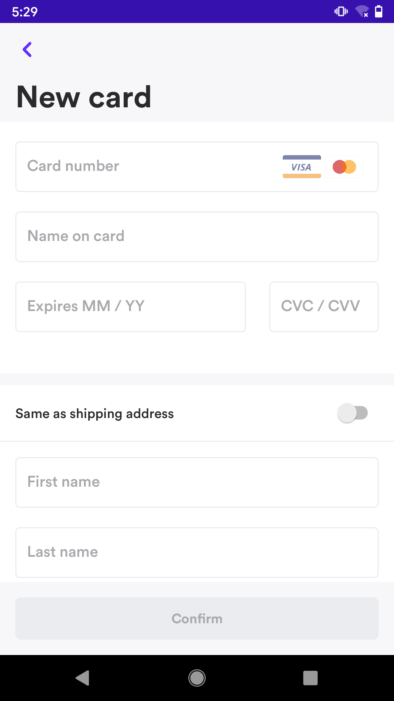

# Airwallex Android SDK
Airwallex Android SDK is a flexible tool that enables you to integrate payment methods into your Android App. It also includes a prebuilt UI that provides you the flexibility to choose to use any part of it, while replacing the rest with your own UI.

This section will guide you through the process of integrating Airwallex Android SDK. We assume you are an Android developer and familiar with Android Studio and Gradle.

To accept online payments with Airwallex Android SDK, please complete preparation work first and choose the integration option according to your need. 

*Preparation*
1. [Before you start](#before-you-start) to use SDK, you need to set up SDK, complete configuration, and create payment intent in your server.

*Integration options*
1. [Airwallex API Integration](#airwallex-api-integration)If you prefer to use your own payment UI, you can choose to integrate Airwallex Android SDK via API.
2. [Airwallex Native UI integration](#airwallex-native-ui-integration)You can choose to use Airwallex Android SDK with our prebuilt UI page

Our demo application is available open source on [Github](https://github.com/airwallex/airwallex-payment-android) and it will help you to better understand how to integrate Airwallex Android SDK in your Android App.

## Contents
* [Overview](#Overview)
    * [Airwallex API](#airwallex-api)
    * [Airwallex Native UI](#airwallex-native-ui)
* [Before you start](#before-you-start)
    * [Step1: Set up SDK](#step1-set-up-sdk)
    * [Step2: Configuration and preparation](#step-2-configuration-and-preparation)
        * [Configuration the SDK](#configuration-the-sdk)
        * [Create Payment Intent](#create-payment-intent-on-the-merchants-server)
* [Airwallex Native UI integration](#airwallex-native-ui-integration)
    * [Edit Shipping Info](#edit-shipping-info)
    * [Selecting payment method page](#selecting-payment-method-page)
    * [Input card information module](#input-card-information-module)
    * [Confirm payment intent page](#confirm-payment-intent-page)
    * [Use the entire Native UI in one flow](#use-the-entire-native-ui-in-one-flow)
    * [Custom Theme](#custom-theme)
* [Airwallex API integration](#airwallex-api-integration)
    * [Cards](#cards)
    * [Alipay, AlipayHK, DANA, GCash, Kakao Pay, Touch ‘n Go](#alipay-alipayhk-dana-gcash-kakao-pay-touch-n-go)
    * [WeChat](#wechat)
* [SDK Example](#sdk-example)
* [Test Card Numbers](#test-card-numbers)
* [Contributing](#Contributing)

## Overview

### Airwallex API

Airwallex Android SDK is a flexible tool that enables you to integrate payment methods into your Android App. 

Note: The Airwallex Android SDK is compatible with apps supporting Android API level 19 and above and SDK file size is 3188.04KB approximately

Payment methods supported: 
- Cards: [`Visa, Mastercard`](#cards). If you want to integrate Airwallex API without our Native UI for card payments, then your website is required to be PCI-DSS compliant. 
- E-Wallets: [`Alipay`](#alipay), [`AlipayHK`](#alipayhk), [`DANA`](#dana), [`GCash`](#gcash), [`Kakao Pay`](#kakao-pay), [`Touch ‘n Go`](#touch-n-go), [`WeChat Pay`](#wechat-pay)

### Airwallex Native UI
Airwallex Native UI is a prebuilt UI which enables you to customize the UI color and fit your App theme. You can use these components separately, or pack our prebuilt UI into one flow to present your payment.
|#|Native UI|Picture|
|---|---|----
|1|[`Edit shipping info page`](#edit-shipping-info)<br/>This page contains a detailed shipping form for shopper to fill in, after the shopper successfully saved the form, the shipping info object will be returned|<p align="center"></p>
|2|[`Select payment method page`](#selecting-payment-method-page)<br/>This page will display all the available payment methods to shopper, the shopper can choose any one of them to pay|<p align="center"></p>
|3|[`Input card information module`](#input-card-information-module)<br/>This module contains card number, expiration date and cvv.|<p align="center"></p>
|4|[`Confirm payment intent page`](#confirm-payment-intent-page)<br/>You need to pass in a PaymentIntent object and a PaymentMethod object. It will display the current selected payment amount, encapsulate the specific operation of payment, and return the PaymentIntent or Exception through the callback method|<p align="center"></p>

## Before you start

### Step1: Set up SDK
The Airwallex Android SDK is compatible with apps supporting Android API level 19 and above.

- Install the SDK
To install the SDK, in your app-level `build.gradle`, add the following:

```groovy
    dependencies {
        implementation 'com.airwallex:airwallex-core:2.0.4'
    }
```

- Add the `cardinalcommerce` Maven repo

Additionally, add the following Maven repository and (non-sensitive) credentials to your app-level `build.gralde`:
```groovy
repositories {
    maven {
        url "https://cardinalcommerce.bintray.com/android"
        credentials {
            username 'qiao.zhao@cardinalcommerce'
            password '99796fb351b999db8dced5b3f6ba6015efc862e7'
        }
    }
}
```

### Step 2: Configuration and preparation
After setting up the SDK, you are required to config your SDK with some parameters. Before using Airwallex SDK to confirm payment intents and complete the payments, you shall create payment intents in your own server, to make sure you maintain information in your own system
#### Configuration the SDK

We provide some parameters that can be used to debug the SDK, better to be called in Application
```groovy
    Airwallex.initialize(
        AirwallexConfiguration.Builder()
            .enableLogging(true)                // Enable log in sdk, and don’t forogt to set to false when it is ready to release
            .setEnvironment(Environment.DEMO)   // You can change the environment to DEMO or PRODUCTION. It must be set to PRODUCTION when it is ready to release.
            .build()
    )
```

#### Create Payment Intent (On the Merchant’s server)

Before confirming the `PaymentIntent`, You must create a `PaymentIntent` on the server and pass it to the client.

> Follow these steps to create a PaymentIntent on the Merchant’s server
>1. To begin you will need to obtain an access token to allow you to reach Airwallex API endpoints. Using your unique Client ID and API key (these can be generated within [Account settings > API keys](https://www.airwallex.com/app/settings/api)) you can call the Authentication API endpoint. On success, an access token will be granted.
>
>2. Create customer(optional) allows you to save your customers’ details, attach payment methods so you can quickly retrieve the supported payment methods as your customer checks out on your shopping site. [`/api/v1/pa/customers/create`](https://www.airwallex.com/docs/api#/Payment_Acceptance/Customers/_api_v1_pa_customers_create/post)
>
>3. Finally, you need to create a `PaymentIntent` object on the Merchant’s server via [`/api/v1/pa/payment_intents/create`](https://www.airwallex.com/docs/api#/Payment_Acceptance/Payment_Intents/_api_v1_pa_payment_intents_create/post) and pass it to the client.
>
>4. In the response of each payment intent, you will be returned with client_secret, which you will need to store for later uses. 

After creating the payment intent, you can use Airwallex SDK to confirm payment intent and enable the shopper to complete the payment with selected payment methods 

Next Step:
- Integrate with Airwallex Native UI to present the payment flow to the shopper. 
- If you don’t want to use the prebuilt UI, you can choose to use your own UI page instead. Then you need to integrate with different payment flows for different payment methods you want to support. 


## Airwallex Native UI integration
We provide native screens to facilitate the integration of payment functions.
You can use these individually, or take all of the prebuilt UI in one flow by following the Integration guide.

1. Initialize an Airwallex object, it’s the entry-point of the Airwallex SDK
```kotlin
    val airwallex = Airwallex(this)
```

2. Build a `AirwallexSession` object
```kotlin
    private fun buildSessionWithIntent(paymentIntent: PaymentIntent? = null, customerId: String? = null): AirwallexSession {
        return when (checkoutMode) {
            AirwallexCheckoutMode.PAYMENT -> {
                if (paymentIntent == null) {
                    throw Exception("PaymentIntent is required")
                }
                AirwallexPaymentSession.Builder(paymentIntent).build()
            }
            AirwallexCheckoutMode.RECURRING_WITH_INTENT -> {
                if (paymentIntent == null) {
                    throw Exception("PaymentIntent is required")
                }
                AirwallexRecurringWithIntentSession.Builder(paymentIntent, nextTriggerBy).build()
            }
            AirwallexCheckoutMode.RECURRING -> {
                AirwallexRecurringSession.Builder(nextTriggerBy, Settings.currency, BigDecimal.valueOf(Settings.price.toDouble()), customerId)
                    .setShipping(shipping)
                    .build()
            }
        }
    }
```

3. Set up an `ClientSecretProvider`
In your app, make your API client class implement the `ClientSecretProvider` interface, which defines a single method, `createClientSecret()`. When implementing this method, pass the customerId parameter along to your `generate_client_secret` endpoint. Consult our Example App to see this in practice.
```kotlin
class ExampleClientSecretProvider : ClientSecretProvider {

    private val api: Api
        get() {
            if (TextUtils.isEmpty(Settings.baseUrl)) {
                throw IllegalArgumentException("Base url should not be null or empty")
            }
            return ApiFactory(Settings.baseUrl).buildRetrofit().create(Api::class.java)
        }

    override fun createClientSecret(customerId: String, updateListener: ClientSecretUpdateListener) {
        CoroutineScope(Dispatchers.IO).launch {
            val response = kotlin.runCatching { api.createClientSecret(customerId) }
            withContext(Dispatchers.Main) {
                response.fold(
                    onSuccess = {
                        updateListener.onClientSecretUpdate(customerId, it.string())
                    },
                    onFailure = {
                        updateListener.onClientSecretUpdateFailure(it.message ?: "")
                    }
                )
            }
        }
    }
}
```

### Edit shipping info
Use `presentShippingFlow` to allow users to provide a shipping address as well as select a shipping method. `shipping` parameter is optional.
```kotlin
    airwallex.presentShippingFlow(shipping,
        object : Airwallex.PaymentShippingListener {
            override fun onSuccess(shipping: Shipping) {
                Log.d(TAG, "Save the shipping success")
            }

            override fun onCancelled() {
                Log.d(TAG, "User cancel edit shipping")
            }
        })
```

### Selecting payment method page
Use `presentSelectPaymentMethodFlow` method to display the customer with the payment methods and allow them to select one or add new ones. To use this method, you need to pass in a `PaymentIntent` and `ClientSecretProvider` object
```kotlin
    private val clientSecretProvider by lazy {
        ExampleClientSecretProvider()
    }
    val session = buildSessionWithIntent(paymentIntent)
    airwallex.presentSelectPaymentMethodFlow(session, clientSecretProvider,
        object : Airwallex.PaymentMethodListener {
            override fun onSuccess(paymentMethod: PaymentMethod, cvc: String?) {
                Log.d(TAG, "Select PaymentMethod success")
            }

            override fun onCancelled() {
                Log.d(TAG, "User cancel select PaymentMethod")
            }
        })
```

### Input card information module
Use `presentAddPaymentMethodFlow` to collect card details from your customer. Needs to pass in a `AirwallexSession` and `ClientSecretProvider` object
```kotlin
    private val clientSecretProvider by lazy {
        ExampleClientSecretProvider()
    }
    val session = buildSessionWithIntent(paymentIntent)
    airwallex.presentAddPaymentMethodFlow(session, clientSecretProvider,
        object : Airwallex.AddPaymentMethodListener {
            override fun onSuccess(paymentMethod: PaymentMethod, cvc: String) {
                Log.d(TAG, "Create PaymentMethod success")
            }

            override fun onCancelled() {
                Log.d(TAG, "User cancel create PaymentMethod")
            }
        })
```

### Confirm payment intent page
Use `presentPaymentDetailFlow` to confirm a payment intent. Needs to pass in a `AirwallexSession` object
```kotlin
    val session = buildSessionWithIntent(paymentIntent)
    airwallex.presentPaymentDetailFlow(session, paymentMethod, paymentConsentId, cvc,
        object : Airwallex.PaymentIntentListener {
           override fun onSuccess(paymentIntent: PaymentIntent) {
               Log.d(TAG, "Confirm payment intent success")
            }

           override fun onFailed(exception: Exception) {
               Log.d(TAG, "Confirm payment intent failed")
           }
                           
           override fun onCancelled() {
               Log.d(TAG, "User cancel confirm payment intent")
           }
        })
```

### Use the entire Native UI in one flow
Use `presentPaymentFlow` to complete the entire payment flow. Needs to pass in a `AirwallexSession` and `ClientSecretProvider` object
```kotlin
    private val clientSecretProvider by lazy {
        ExampleClientSecretProvider()
    }
    val session = buildSessionWithIntent(paymentIntent)
    airwallex.presentPaymentFlow(session, clientSecretProvider,
        object : Airwallex.PaymentIntentListener {
            override fun onSuccess(paymentIntent: PaymentIntent) {
                Log.d(TAG, "Confirm payment intent success")
            }

            override fun onFailed(exception: Exception) {
                Log.d(TAG, "Confirm payment intent failed")
            }
                
            override fun onCancelled() {
                Log.d(TAG, "User cancel confirm payment intent")
            }
        })
```
### Custom Theme
You can overwrite these color values in your app. https://developer.android.com/guide/topics/ui/look-and-feel/themes#CustomizeTheme
```
    <!--   a secondary color for controls like checkboxes and text fields -->
    <color name="airwallex_color_accent">@color/color_accent</color>

    <!--   color for the app bar and other primary UI elements -->
    <color name="airwallex_color_primary">@color/color_primary</color>

    <!--   a darker variant of the primary color, used for
           the status bar (on Android 5.0+) and contextual app bars -->
    <color name="airwallex_color_primary_dark">@color/color_primary_dark</color>
```

## Airwallex API integration

PaymentMethod objects represent your customer’s payment instruments. They can be used with PaymentIntents to complete the payment.

Supported payment methods: [`Cards`](#cards), [`Alipay`](#alipay), [`AlipayHK`](#alipayhk), [`DANA`](#dana), [`GCash`](#gcash), [`Kakao Pay`](#kakao-pay), [`Touch ‘n Go`](#touch-n-go), [`WeChat Pay`](#wechat-pay). You can choose to integrate with the payment method you need to support and we will display the available payment methods based on the transaction currency. The additional implementation effort for offering a new payment method depends on your type of integration.

### Cards

*Preconditions*: You have created a payment intent by [how to create payment intent](#create-payment-intent-on-the-merchants-server)

1. Initializes an `Airwallex` object, it's the entry-point of the Airwallex SDK.

```kotlin
    val airwallex = Airwallex(this)
```

2. Get a PaymentMethod through [Select Payment Method](#selecting-payment-method-page) or [Create Payment Method](#input-card-information-module)

3. Then you can confirm the payment intent by calling the `checkout` method. 
```kotlin
    private fun buildSessionWithIntent(paymentIntent: PaymentIntent? = null, customerId: String? = null): AirwallexSession {
        return when (checkoutMode) {
            AirwallexCheckoutMode.PAYMENT -> {
                if (paymentIntent == null) {
                    throw Exception("PaymentIntent is required")
                }
                AirwallexPaymentSession.Builder(paymentIntent).build()
            }
            AirwallexCheckoutMode.RECURRING_WITH_INTENT -> {
                if (paymentIntent == null) {
                    throw Exception("PaymentIntent is required")
                }
                AirwallexRecurringWithIntentSession.Builder(paymentIntent, nextTriggerBy).build()
            }
            AirwallexCheckoutMode.RECURRING -> {
                AirwallexRecurringSession.Builder(nextTriggerBy, Settings.currency, BigDecimal.valueOf(Settings.price.toDouble()), customerId)
                    .setShipping(shipping)
                    .build()
            }
        }
    }
    val listener = object : Airwallex.PaymentListener<PaymentIntent> {
        override fun onSuccess(response: PaymentIntent) {
            // Confirm Payment Intent success
        }

        override fun onFailed(exception: Exception) {
            // Confirm Payment Intent failed
        }
    }

    val session = buildSessionWithIntent(paymentIntent)
    airwallex.checkout(session, paymentMethod, paymentConsentId, cvc, listener)
```

And in your host Activity or Fragment, implement Activity#onActivityResult and handle the result.
```kotlin
    override fun onActivityResult(requestCode: Int, resultCode: Int, data: Intent?) {
        super.onActivityResult(requestCode, resultCode, data)
        
        // You must call this method on `onActivityResult`
        airwallex.handlePaymentData(requestCode, resultCode, data)
    }
```
4. To obtain the payment result, you can use the `retrievePaymentIntent` method and check the latest status. Then you can prompt the shopper with the result.
```kotlin
    airwallex.retrievePaymentIntent(
        params = RetrievePaymentIntentParams(
            paymentIntentId = paymentIntentId,  // the ID of the `PaymentIntent`, required.
            clientSecret = clientSecret         // the clientSecret of `PaymentIntent`, required.
        ),
        listener = object : Airwallex.PaymentListener<PaymentIntent> {
            override fun onSuccess(response: PaymentIntent) {
                if (response.status == PaymentIntentStatus.SUCCEEDED) {
                   // Payment successful
                }
            }
    
            override fun onFailed(exception: Exception) {
                
            }
        })
```

### Alipay, AlipayHK, DANA, GCash, Kakao Pay, Touch ‘n Go

*Preconditions*: You have created a payment intent by [how to create payment intent](#create-payment-intent-on-the-merchants-server)

*Note*:
To redirect the shopper to the page you designated after the payment completed, you need to pass in returnUrl when you create the PaymentIntent. 
```kotlin
    api.createPaymentIntent(
        mutableMapOf(
                
            // The HTTP request method that you should use. After the shopper completes the payment, they will be redirected back to your return_url.
            "return_url" to "$airwallexcheckout://$packageName"
        )
    )
```

1. Initializes an `Airwallex` object, it's the entry-point of the Airwallex SDK.

```kotlin
    val airwallex = Airwallex(this)
```

2. To redirect the shopper to the return_url you designated, you also need to add below info in the AndroidManifest before confirming the payment intent.
```xml
    <activity android:name="...">
        <intent-filter>

            <data
                android:host="${applicationId}"
                android:scheme="${checkoutRedirectScheme}" />
        </intent-filter>
    </activity>
```

3. To confirm the payment intent, you need to use the `checkout` method. 
```kotlin
    private fun buildSessionWithIntent(paymentIntent: PaymentIntent? = null, customerId: String? = null): AirwallexSession {
        return when (checkoutMode) {
            AirwallexCheckoutMode.PAYMENT -> {
                if (paymentIntent == null) {
                    throw Exception("PaymentIntent is required")
                }
                AirwallexPaymentSession.Builder(paymentIntent).build()
            }
            AirwallexCheckoutMode.RECURRING_WITH_INTENT -> {
                if (paymentIntent == null) {
                    throw Exception("PaymentIntent is required")
                }
                AirwallexRecurringWithIntentSession.Builder(paymentIntent, nextTriggerBy).build()
            }
            AirwallexCheckoutMode.RECURRING -> {
                AirwallexRecurringSession.Builder(nextTriggerBy, Settings.currency, BigDecimal.valueOf(Settings.price.toDouble()), customerId)
                    .setShipping(shipping)
                    .build()
            }
        }
    }
    val session = buildSessionWithIntent(paymentIntent)
  airwallex.checkout(session = session, paymentMethod = paymentMethod, listener = listener)
```

And in your host Activity or Fragment, implement Activity#onActivityResult and handle the result.
```kotlin
    override fun onActivityResult(requestCode: Int, resultCode: Int, data: Intent?) {
        super.onActivityResult(requestCode, resultCode, data)
        
        // You must call this method on `onActivityResult`
        airwallex.handlePaymentData(requestCode, resultCode, data)
    }
```

4. After confirming the payment intent, you need to use the handleAction method to pull up the corresponding App in the shopper’s mobile phone. The shopper will complete the payment within the wallet App.
```kotlin
    try { 
        airwallex.handleAction(redirectUrl)
    } catch (e: RedirectException) {
        showPaymentError(e.localizedMessage)
    }
```


5. To obtain the payment result, you can use the `retrievePaymentIntent` method and check the latest status. Then you can prompt the shopper with the result. 
```kotlin
    airwallex.retrievePaymentIntent(
        params = RetrievePaymentIntentParams(
            paymentIntentId = paymentIntentId,  // the ID of the `PaymentIntent`, required.
            clientSecret = clientSecret         // the clientSecret of `PaymentIntent`, required.
        ),
        listener = object : Airwallex.PaymentListener<PaymentIntent> {
            override fun onSuccess(response: PaymentIntent) {
                if (response.status == PaymentIntentStatus.SUCCEEDED) {
                   // Payment successful
                }
            }
    
            override fun onFailed(exception: Exception) {
                
            }
        })
```

### WeChat

*Preconditions*: 
- You have created a payment intent by [how to create payment intent](#create-payment-intent-on-the-merchants-server)
- Register app on [WeChat Pay](https://open.weixin.qq.com/) will provide an unique APP_ID and APP_SIGNATURE to the Merchant. Then please contact us, we will register your WeChat APPID and APP_SIGNATURE  in the Airwallex dashboard.

1. Initializes an `Airwallex` object, it's the entry-point of the Airwallex SDK.

```kotlin
    val airwallex = Airwallex(this)
```

2. To confirm the payment intent, you need to use the `checkout` method. 
```kotlin
    val listener = object : Airwallex.PaymentListener<PaymentIntent> {
        override fun onSuccess(response: PaymentIntent) {
            // Confirm Payment Intent success
        }

        override fun onFailed(exception: Exception) {
            // Confirm Payment Intent failed
        }
    }
    private fun buildSessionWithIntent(paymentIntent: PaymentIntent? = null, customerId: String? = null): AirwallexSession {
        return when (checkoutMode) {
            AirwallexCheckoutMode.PAYMENT -> {
                if (paymentIntent == null) {
                    throw Exception("PaymentIntent is required")
                }
                AirwallexPaymentSession.Builder(paymentIntent).build()
            }
            AirwallexCheckoutMode.RECURRING_WITH_INTENT -> {
                if (paymentIntent == null) {
                    throw Exception("PaymentIntent is required")
                }
                AirwallexRecurringWithIntentSession.Builder(paymentIntent, nextTriggerBy).build()
            }
            AirwallexCheckoutMode.RECURRING -> {
                AirwallexRecurringSession.Builder(nextTriggerBy, Settings.currency, BigDecimal.valueOf(Settings.price.toDouble()), customerId)
                    .setShipping(shipping)
                    .build()
            }
        }
    }
    val session = buildSessionWithIntent(paymentIntent)
    airwallex.checkout(session = session, paymentMethod = paymentMethod, listener = listener)
```

And in your host Activity or Fragment, implement Activity#onActivityResult and handle the result.
```kotlin
    override fun onActivityResult(requestCode: Int, resultCode: Int, data: Intent?) {
        super.onActivityResult(requestCode, resultCode, data)
        
        // You must call this method on `onActivityResult`
        airwallex.handlePaymentData(requestCode, resultCode, data)
    }
```

3. After successfully confirming the payment intent, Airwallex will return all the parameters that are needed to pull up WeChat Pay in the shopper's mobile phone. You need to call [WeChat Pay SDK](https://pay.weixin.qq.com/wiki/doc/api/wxpay/pay/In-AppPay/chapter6_2.shtml) to start WeChat pay.
Check the [WeChat Pay Sample](https://github.com/airwallex/airwallex-payment-android/tree/master) for more details.

```kotlin
    // The callback after confirmPaymentIntent succeeds will include payment intent. `paymentIntent.weChat` contains all the data needed for WeChat Pay, then you need to send `weChat` to [WeChat Pay SDK](https://pay.weixin.qq.com/wiki/doc/api/wxpay/pay/In-AppPay/chapter6_2.shtml).

    val weChat = response.weChat
    val weChatReq = PayReq()
    weChatReq.appId = weChat.appId
    weChatReq.partnerId = weChat.partnerId
    weChatReq.prepayId = weChat.prepayId
    weChatReq.packageValue = weChat.`package`
    weChatReq.nonceStr = weChat.nonceStr
    weChatReq.timeStamp = weChat.timestamp
    weChatReq.sign = weChat.sign
     
    val weChatApi = WXAPIFactory.createWXAPI(applicationContext, appId)
    weChatApi.sendReq(weChatReq)
```
4. After the payment is completed, you can redirect the shopper back to your App using the onResp() method, then it can retrieve the payment intent status after your server is notified, so please keep listening to the notification.
```kotlin
    override fun onResp(resp: BaseResp?) {
        if (resp is PayResp) {
            when (resp.errCode) {
                BaseResp.ErrCode.ERR_OK -> listener?.onSuccess()
                BaseResp.ErrCode.ERR_COMM -> listener?.onFailure(errCode.toString(), errText)
                BaseResp.ErrCode.ERR_USER_CANCEL -> listener?.onCancel()
                else -> listener?.onFailure(errCode.toString(), errText)
            }

        }
    }
```

5. To obtain the payment result, you can call the `retrievePaymentIntent` method and check the latest payment status. Then you can prompt the shopper with the result.
```kotlin
    airwallex.retrievePaymentIntent(
        params = RetrievePaymentIntentParams(
            paymentIntentId = paymentIntentId,  // the ID of the `PaymentIntent`, required.
            clientSecret = clientSecret         // the clientSecret of `PaymentIntent`, required.
        ),
        listener = object : Airwallex.PaymentListener<PaymentIntent> {
            override fun onSuccess(response: PaymentIntent) {
                if (response.status == PaymentIntentStatus.SUCCEEDED) {
                   // Payment successful
                }
            }
    
            override fun onFailed(exception: Exception) {
                
            }
        })
```

## SDK Example
This sample app demonstrates integrating with the Airwallex Android SDK using its prebuilt UI components to manage the checkout flow, including specifying a shipping address and selecting a Payment Method.

To run the example project, you should follow these steps.

1. Run the following script to clone the repository to your local machine
`git clone git@github.com:airwallex/airwallex-payment-android.git`

2. Open Android Studio and import the project by selecting the `build.gradle` file from the cloned repository

3. Goto [Airwallex Account settings > API keys](https://www.airwallex.com/app/settings/api), then copy `Client ID` and` API key` to [`Settings.kt`](https://github.com/airwallex/airwallex-payment-android/blob/master/sample/src/main/java/com/airwallex/paymentacceptance/Settings.kt)
```
    private const val BASE_URL = "put your base url here"
    private const val API_KEY = "put your api key here"
    private const val CLIENT_ID = "put your client id here"
```

4. Register app on [WeChat Pay](https://pay.weixin.qq.com/index.php/public/wechatpay), then copy `App ID` and `App Signature` to [`Settings.kt`](https://github.com/airwallex/airwallex-payment-android/blob/master/sample/src/main/java/com/airwallex/paymentacceptance/Settings.kt)
```
    private const val WECHAT_APP_ID = "put your WeChat app id here"
    private const val WECHAT_APP_SIGNATURE = "put your WeChat app signature here"
```

5. Run the `sample` project

## Test Card Numbers
https://cardinaldocs.atlassian.net/wiki/spaces/CCen/pages/903577725/EMV+3DS+Test+Cases

## Contributing
We welcome contributions of any kind including new features, bug fixes, and documentation 
