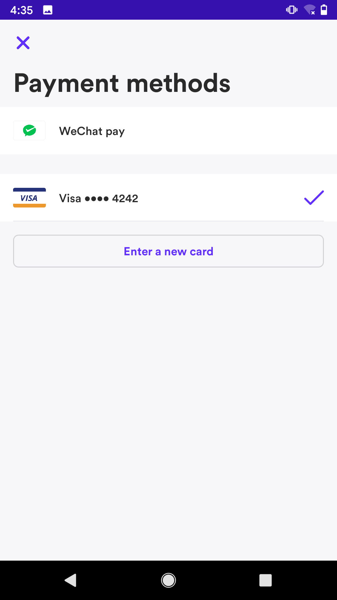
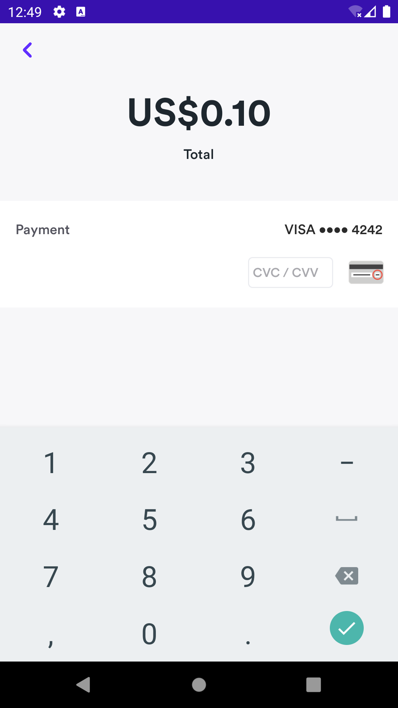

# Airwallex Android SDK
Airwallex Android SDK is a flexible tool that enables you to integrate payment methods into your Android App. It also includes a prebuilt UI that provides you the flexibility to choose to use any part of it, while replacing the rest with your own UI. Also, Airwallex Native UI enables you to customize the color to fit with your App theme.

This section guides you through the process of integrating Airwallex Android SDK. We assume you are an Android developer and familiar with Android Studio and Gradle.

To accept online payments with Airwallex Android SDK, you need to
1. [Install & Initialize the Android SDK](#airwallex-api-integration).
2. [Build your payment flow](#native-ui-integration).
3. [Select the Payment Methods you want to integrate](#set-up-payment-methods)

Our demo application is available open source on [Github](https://github.com/airwallex/airwallex-payment-android) and it will help you to better understand how to integrate Airwallex Android SDK in your Android App.

## Contents
* [Overview](#Overview)
    * [Airwallex API](#airwallex-api)
    * [Airwallex Native UI](#airwallex-native-ui)
* [Before you start](#before-you-start)
    * [Step1: Set up SDK](#step1-set-up-sdk)
    * [Step 2: Configuration and preparation](#step-2-configuration-and-preparation)
    * [Next Step](#next-step)
* [Native UI integration](#native-ui-integration)
    * [Edit Shipping Info](#edit-shipping-info)
    * [Select PaymentMethod](#select-paymentmethod)
    * [Create PaymentMethod](#create-paymentmethod)
    * [Confirm PaymentIntent](#confirm-paymentintent)
    * [Entire Payment Flow](#entire-payment-flow)
    * [Custom Theme](#custom-theme)
* [Set up payment methods](#set-up-payment-methods)
    * [Cards](#cards)
    * [Alipay, AlipayHK, DANA, GCash, Kakao Pay, Touch ‘n Go](#alipay-alipayhk-dana-gcash-kakao-pay-touch-n-go)
    * [WeChat Pay](#wechat-pay)
* [SDK Example](#sdk-example)
* [Test Card Numbers](#test-card-numbers)
* [Contributing](#Contributing)

## Overview

### Airwallex API

Airwallex Android SDK is a flexible tool that enables you to integrate payment methods into your Android App. It also includes a prebuilt UI that provides you the flexibility to choose to use any part of it, while replacing the rest with your own UI. Also, Airwallex Native UI enables you to customize the color to fit with your App theme. 

Note: The Airwallex Android SDK is compatible with apps supporting Android API level 19 and above and SDK file size is 3188.04KB

Payment methods supported: 
- Cards: [`Visa, Mastercard`](#cards). If you want to integrate Airwallex API without our Native UI for card payments, then your website is required to be PCI-DSS compliant. 
- E-Wallets: [`Alipay`](#alipay), [`AlipayHK`](#alipayhk), [`DANA`](#dana), [`GCash`](#gcash), [`Kakao Pay`](#kakao-pay), [`Touch ‘n Go`](#touch-n-go), [`WeChat Pay`](#wechat-pay)

### Airwallex Native UI
Airwallex Native UI is a prebuilt UI which enables you to customize the UI color and fit your App theme. You can use these components separately, or pack our prebuilt UI into one flow to present your payment.

|#|Native UI|Picture|
|---|---|----
|1|[`Edit Shipping Info`](#edit-shipping-info)<br/>After successfully saving, it will return a shipping object|<p align="center"></p>
|2|[`Select PaymentMethod`](#select-paymentmethod)<br/>It will display all the saved payment methods of the current customer, you can choose any one to pay|<p align="center"></p>
|3|[`Create PaymentMethod`](#create-paymentmethod)<br/>You can enter a credit card number, expiration time and cvc to create a payment method.|<p align="center"></p>
|4|[`Confirm PaymentIntent`](#confirm-paymentintent)<br/>You need to pass in a PaymentIntent object and a PaymentMethod object. It will display the current payment amount has been paid, encapsulated the specific operation of payment, will return the PaymentIntent or Exception through the callback method|<p align="center"></p>

## Before you start

### Step1: Set up SDK
The Airwallex Android SDK is compatible with apps supporting Android API level 19 and above.

- Install the SDK
To install the SDK, in your app-level `build.gradle`, add the following:

```groovy
    dependencies {
        implementation 'com.airwallex:airwallex-core:2.0.3'
    }
```

- Add the `cardinalcommerce` Maven repo

Additionally, add the following Maven repository and (non-sensitive) credentials to your app-level `build.gralde`:
```groovy
repositories {
    maven {
        url "https://cardinalcommerce.bintray.com/android"
        credentials {
            username 'qiao.zhao@cardinalcommerce'
            password '99796fb351b999db8dced5b3f6ba6015efc862e7'
        }
    }
}
```

### Step 2: Configuration and preparation
After setting up the SDK, you are also required to config your SDK. Before using Airwallex SDK to confirm payment intents and complete the payments, you shall create payment intents in your own server, to make sure you obtained order information in your own system.

```groovy
    Airwallex.initialize(
        AirwallexConfiguration.Builder()
            .enableLogging(true)                // Enable log in sdk, best set to false in release version
            .setEnvironment(Environment.DEMO)   // You can change the environment of Airwallex
            .build()
    )
```

- Create Payment Intent (On Merchant's server)

Before confirming the `PaymentIntent`, the merchant must create a `PaymentIntent` on the server and pass it to the client.

> Follow these steps to create a PaymentIntent in Merchat's server
>1. To begin you will need to obtain an access token to allow you to reach all other API endpoints. Using your unique Client ID and API key (these can be generated within [Account settings > API keys](https://www.airwallex.com/app/settings/api)) you can call the Authentication API endpoint. On success, an access token will be granted.
>
>2. Create customer(optional) allows you to save your customers' details, attach payment methods so you can quickly retrieve the supported payment methods as your customer checks out on your shopping site. [`/api/v1/pa/customers/create`](https://www.airwallex.com/docs/api#/Payment_Acceptance/Customers/_api_v1_pa_customers_create/post)
>
>3. Finally, you need to create a `PaymentIntent` object on your own server via [`/api/v1/pa/payment_intents/create`](https://www.airwallex.com/docs/api#/Payment_Acceptance/Payment_Intents/_api_v1_pa_payment_intents_create/post) and pass it to your client

### Next Step

- We provide [`native screens`](#native-ui-integration) to facilitate the integration of payment functions.
- You can start payment flow with a [`payment method`](#set-up-payment-methods)
- You can also try the [`example`](#sdk-example) that we have provided

## Native UI integration
We provide native screens to facilitate the integration of payment functions.
The merchant can use these individually, or take all of the prebuilt UI in one flow by following the Integration guide.

### Edit Shipping Info
Customize the usage of shipping info. The merchant can call the `presentShippingFlow` method to use the shipping screen in the SDK. `shipping` parameter is optional. After successfully saving, it will return a shipping object

```kotlin
    airwallex.presentShippingFlow(shipping,
        object : Airwallex.PaymentShippingListener {
            override fun onSuccess(shipping: Shipping) {
                Log.d(TAG, "Save the shipping success")
            }

            override fun onCancelled() {
                Log.d(TAG, "User cancel edit shipping")
            }
        })
```

### Select PaymentMethod
Customize the usage of select one of payment methods. The merchant can call the `presentSelectPaymentMethodFlow` method to use the PaymentMethod screen in the SDK, and needs to pass in a PaymentIntent and ClientSecretProvider object. It will display all the saved payment methods of the current customer, the shopper can choose any one to pay.
```kotlin
    private val clientSecretProvider by lazy {
        ExampleClientSecretProvider()
    }
    airwallex.presentSelectPaymentMethodFlow(paymentIntent, clientSecretProvider,
        object : Airwallex.PaymentMethodListener {
            override fun onSuccess(paymentMethod: PaymentMethod, cvc: String?) {
                Log.d(TAG, "Select PaymentMethod success")
            }

            override fun onCancelled() {
                Log.d(TAG, "User cancel select PaymentMethod")
            }
        })
```

### Create PaymentMethod
Customize the usage of card creation. The shopper can enter a credit card number, expiration time and cvc to create a payment method. The merchant needs to pass in a `paymentIntent` and `ClientSecretProvider` object.
```kotlin
    private val clientSecretProvider by lazy {
        ExampleClientSecretProvider()
    }
    airwallex.presentAddPaymentMethodFlow(paymentIntent,
        object : Airwallex.AddPaymentMethodListener {
            override fun onSuccess(paymentMethod: PaymentMethod, cvc: String) {
                Log.d(TAG, "Create PaymentMethod success")
            }

            override fun onCancelled() {
                Log.d(TAG, "User cancel create PaymentMethod")
            }
        })
```

### Confirm PaymentIntent
Customize the usage of payment details. The merchant needs to pass in a `PaymentIntent` object and a `PaymentMethod` object. It will display the current payment amount has been paid, encapsulated the specific operation of payment, will return the `PaymentIntent` or `Exception` through the callback method
```kotlin
    airwallex.presentPaymentDetailFlow(paymentIntent, paymentMethod,
        object : Airwallex.PaymentIntentListener {
           override fun onSuccess(paymentIntent: PaymentIntent) {
               Log.d(TAG, "Confirm payment intent success")
            }

           override fun onFailed(exception: Exception) {
               Log.d(TAG, "Confirm payment intent failed")
           }
                           
           override fun onCancelled() {
               Log.d(TAG, "User cancel confirm payment intent")
           }
        })
```

### Entire Payment Flow
Show the entire Payment Flow. Need to pass in a `PaymentIntent` object. The shopper can complete the entire payment process by calling this method, will return the `PaymentIntent` or `Exception`  through the callback method

```kotlin
    private val clientSecretProvider by lazy {
        ExampleClientSecretProvider()
    }
    airwallex.presentPaymentFlow(paymentIntent, clientSecretProvider,
        object : Airwallex.PaymentIntentListener {
            override fun onSuccess(paymentIntent: PaymentIntent) {
                Log.d(TAG, "Confirm payment intent success")
            }

            override fun onFailed(exception: Exception) {
                Log.d(TAG, "Confirm payment intent failed")
            }
                
            override fun onCancelled() {
                Log.d(TAG, "User cancel confirm payment intent")
            }
        })
```
### Custom Theme
The merchant can overwrite these color values in your app. https://developer.android.com/guide/topics/ui/look-and-feel/themes#CustomizeTheme
```
    <!--   a secondary color for controls like checkboxes and text fields -->
    <color name="airwallex_color_accent">@color/color_accent</color>

    <!--   color for the app bar and other primary UI elements -->
    <color name="airwallex_color_primary">@color/color_primary</color>

    <!--   a darker variant of the primary color, used for
           the status bar (on Android 5.0+) and contextual app bars -->
    <color name="airwallex_color_primary_dark">@color/color_primary_dark</color>
```

## Set up payment methods

PaymentMethod objects represent your customer's payment instruments. They can be used with PaymentIntents to complete payments.

We support [`Cards`](#cards), [`Alipay`](#alipay), [`AlipayHK`](#alipayhk), [`DANA`](#dana), [`GCash`](#gcash), [`Kakao Pay`](#kakao-pay), [`Touch ‘n Go`](#touch-n-go), [`WeChat Pay`](#wechat-pay). The merchant can choose the payment method you need to support.

And we will display the available payment methods based on the shopper's current currency. The additional implementation effort for offering a new payment method depends on your type of integration.

### Cards
1. Initializes an `Airwallex` object, it's the Entry-point of the Airwallex SDK.

```kotlin
    val airwallex = Airwallex(this)
```

2. Then you can call the `confirmPaymentIntent` method
```kotlin
    val listener = object : Airwallex.PaymentListener<PaymentIntent> {
        override fun onSuccess(response: PaymentIntent) {
            // Confirm Payment Intent success
        }

        override fun onFailed(exception: Exception) {
            // Confirm Payment Intent failed
        }
    }
    val params = ConfirmPaymentIntentParams.createCardParams(
                     paymentIntentId = paymentIntent.id, // Required
                     clientSecret = requireNotNull(paymentIntent.clientSecret), // Required
                     paymentMethodId = requireNotNull(paymentMethod.id), // Required
                     cvc = requireNotNull(cvc), // Required
                     customerId = paymentIntent.customerId // Optional
                 )
    airwallex.confirmPaymentIntent(params, listener)
```

```kotlin
    override fun onActivityResult(requestCode: Int, resultCode: Int, data: Intent?) {
        super.onActivityResult(requestCode, resultCode, data)
        
        // You must call this method on `onActivityResult`
        airwallex.handlePaymentData(requestCode, resultCode, data)
    }
```

3. After successfully `Cards` payment, the Airwallex server will notify the Merchant, then you can make sure if the `PaymentIntent` is successful by calling the `retrievePaymentIntent` method and checking the `status` of the response.
```kotlin
    airwallex.retrievePaymentIntent(
        params = RetrievePaymentIntentParams(
            paymentIntentId = paymentIntentId,  // the ID of the `PaymentIntent`, required.
            clientSecret = clientSecret         // the clientSecret of `PaymentIntent`, required.
        ),
        listener = object : Airwallex.PaymentListener<PaymentIntent> {
            override fun onSuccess(response: PaymentIntent) {
                if (response.status == PaymentIntentStatus.SUCCEEDED) {
                   // Payment successful
                }
            }
    
            override fun onFailed(exception: Exception) {
                
            }
        })
```

### Alipay, AlipayHK, DANA, GCash, Kakao Pay, Touch ‘n Go
1. Initializes an `Airwallex` object, it's the Entry-point of the Airwallex SDK.

```kotlin
    val airwallex = Airwallex(this)
```

2. pass in `returnUrl` when creating `PaymentIntent`, so that you can jump back to the merchant app after successful payment
```kotlin
    api.createPaymentIntent(
        mutableMapOf(
            
            // The HTTP request method that you should use. After the shopper completes the payment, they will be redirected back to your returnURL using the same method.
            "return_url" to "airwallexcheckout://$packageName"
        )
    )
```
Add below info in the Activity that needs to be jumped back to.
```xml
    <activity android:name="...">
        <intent-filter>
            <action android:name="android.intent.action.VIEW" />

            <category android:name="android.intent.category.DEFAULT" />
            <category android:name="android.intent.category.BROWSABLE" />

            <data
                android:host="${applicationId}"
                android:scheme="airwallexcheckout" />
        </intent-filter>
    </activity>
```

3. Then you can call the `confirmPaymentIntent` method
```kotlin
    val params = when (requireNotNull(paymentMethod.type)) {
        PaymentMethodType.ALIPAY_CN -> {
            ConfirmPaymentIntentParams.createAlipayParams(
                paymentIntentId = paymentIntent.id, // Required
                clientSecret = requireNotNull(paymentIntent.clientSecret), // Required
                customerId = paymentIntent.customerId // Optional
            )
        }
        PaymentMethodType.ALIPAY_HK -> {
            ConfirmPaymentIntentParams.createAlipayHKParams(
                paymentIntentId = paymentIntent.id, // Required
                clientSecret = requireNotNull(paymentIntent.clientSecret), // Required
                customerId = paymentIntent.customerId // Optional
            )
        }
        PaymentMethodType.DANA -> {
            ConfirmPaymentIntentParams.createDanaParams(
                paymentIntentId = paymentIntent.id, // Required
                clientSecret = requireNotNull(paymentIntent.clientSecret), // Required
                customerId = paymentIntent.customerId // Optional
            )
        }
        PaymentMethodType.GCASH -> {
            ConfirmPaymentIntentParams.createGCashParams(
                paymentIntentId = paymentIntent.id, // Required
                clientSecret = requireNotNull(paymentIntent.clientSecret), // Required
                customerId = paymentIntent.customerId // Optional
            )
        }
        PaymentMethodType.KAKAOPAY -> {
            ConfirmPaymentIntentParams.createKakaoParams(
                paymentIntentId = paymentIntent.id, // Required
                clientSecret = requireNotNull(paymentIntent.clientSecret), // Required
                customerId = paymentIntent.customerId // Optional
            )
        }
        PaymentMethodType.TNG -> {
            ConfirmPaymentIntentParams.createTngParams(
                paymentIntentId = paymentIntent.id, // Required
                clientSecret = requireNotNull(paymentIntent.clientSecret), // Required
                customerId = paymentIntent.customerId // Optional
            )
        }
    }
    airwallex.confirmPaymentIntent(params, listener)
```

```kotlin
    override fun onActivityResult(requestCode: Int, resultCode: Int, data: Intent?) {
        super.onActivityResult(requestCode, resultCode, data)
        
        // You must call this method on `onActivityResult`
        airwallex.handlePaymentData(requestCode, resultCode, data)
    }
```

4. After successfully confirming the `PaymentIntent`, you need to call `handleAction` to redirect to the payment screen. After the payment is completed, it will be redirected to the merchant app.
```kotlin
val listener = object : Airwallex.PaymentListener<PaymentIntent> {
        override fun onSuccess(response: PaymentIntent) {
            // Confirm Payment Intent success
            try {
                airwallex.handleAction(paymentIntent.nextAction)
            } catch (e: RedirectException) {
                showPaymentError(e.localizedMessage)
            }
        }

        override fun onFailed(exception: Exception) {
            // Confirm Payment Intent failed
        }
    }
```

5. After successfully payment, the Airwallex server will notify the Merchant, then you can make sure if the `PaymentIntent` is successful by calling the `retrievePaymentIntent` method and checking the `status` of the response.
```kotlin
    airwallex.retrievePaymentIntent(
        params = RetrievePaymentIntentParams(
            paymentIntentId = paymentIntentId,  // the ID of the `PaymentIntent`, required.
            clientSecret = clientSecret         // the clientSecret of `PaymentIntent`, required.
        ),
        listener = object : Airwallex.PaymentListener<PaymentIntent> {
            override fun onSuccess(response: PaymentIntent) {
                if (response.status == PaymentIntentStatus.SUCCEEDED) {
                   // Payment successful
                }
            }
    
            override fun onFailed(exception: Exception) {
                
            }
        })
```

### WeChat Pay
1. Initializes an `Airwallex` object, it's the Entry-point of the Airwallex SDK.

```kotlin
    val airwallex = Airwallex(this)
```

2. Then you can call the `confirmPaymentIntent` method
```kotlin
    val listener = object : Airwallex.PaymentListener<PaymentIntent> {
        override fun onSuccess(response: PaymentIntent) {
            // Confirm Payment Intent success
        }

        override fun onFailed(exception: Exception) {
            // Confirm Payment Intent failed
        }
    }
    val params = ConfirmPaymentIntentParams.createWeChatParams(
                     paymentIntentId = paymentIntent.id, // Required
                     clientSecret = requireNotNull(paymentIntent.clientSecret), // Required
                     customerId = paymentIntent.customerId // Optional
                 )
    airwallex.confirmPaymentIntent(params, listener)
```

```kotlin
    override fun onActivityResult(requestCode: Int, resultCode: Int, data: Intent?) {
        super.onActivityResult(requestCode, resultCode, data)
        
        // You must call this method on `onActivityResult`
        airwallex.handlePaymentData(requestCode, resultCode, data)
    }
```

3. After successfully confirming the `PaymentIntent`, Airwallex will return all the parameters that are needed for WeChat Pay. You need to call [WeChat Pay SDK](https://pay.weixin.qq.com/wiki/doc/api/wxpay/pay/In-AppPay/chapter6_2.shtml) to complete the final payment. Check the [WeChat Pay Sample](https://github.com/airwallex/airwallex-payment-android/tree/master) for more details.
   
```kotlin
    val weChat = response.weChat
    // `weChat` contains all the data needed for WeChat Pay, then you need to send `weChat` to [WeChat Pay SDK](https://pay.weixin.qq.com/wiki/doc/api/wxpay/pay/In-AppPay/chapter6_2.shtml).

    val weChatReq = PayReq()
    weChatReq.appId = weChat.appId
    weChatReq.partnerId = weChat.partnerId
    weChatReq.prepayId = weChat.prepayId
    weChatReq.packageValue = weChat.`package`
    weChatReq.nonceStr = weChat.nonceStr
    weChatReq.timeStamp = weChat.timestamp
    weChatReq.sign = weChat.sign
     
    val weChatApi = WXAPIFactory.createWXAPI(applicationContext, appId)
    weChatApi.sendReq(weChatReq)
```

4. After successfully `WeChat Pay` payment, the Airwallex server will notify the Merchant, then you can make sure if the `PaymentIntent` is successful by calling the `retrievePaymentIntent` method and checking the `status` of the response.
```kotlin
    airwallex.retrievePaymentIntent(
        params = RetrievePaymentIntentParams(
            paymentIntentId = paymentIntentId,  // the ID of the `PaymentIntent`, required.
            clientSecret = clientSecret         // the clientSecret of `PaymentIntent`, required.
        ),
        listener = object : Airwallex.PaymentListener<PaymentIntent> {
            override fun onSuccess(response: PaymentIntent) {
                if (response.status == PaymentIntentStatus.SUCCEEDED) {
                   // Payment successful
                }
            }
    
            override fun onFailed(exception: Exception) {
                
            }
        })
```

## SDK Example
This sample app demonstrates integrating with the Airwallex Android SDK using its prebuilt UI components to manage the checkout flow, including specifying a shipping address and selecting a Payment Method.

To run the example project, you should follow these steps.

1. Run the following script to clone the repository to your local machine
`git clone git@github.com:airwallex/airwallex-payment-android.git`

2. Open Android Studio and import the project by selecting the `build.gradle` file from the cloned repository

3. Goto [Airwallex Account settings > API keys](https://www.airwallex.com/app/settings/api), then copy `Client ID` and` API key` to [`Settings.kt`](https://github.com/airwallex/airwallex-payment-android/blob/master/sample/src/main/java/com/airwallex/paymentacceptance/Settings.kt)
```
    private const val BASE_URL = "put your base url here"
    private const val API_KEY = "put your api key here"
    private const val CLIENT_ID = "put your client id here"
```

4. Register app on [WeChat Pay](https://pay.weixin.qq.com/index.php/public/wechatpay), then copy `App ID` and `App Signature` to [`Settings.kt`](https://github.com/airwallex/airwallex-payment-android/blob/master/sample/src/main/java/com/airwallex/paymentacceptance/Settings.kt)
```
    private const val WECHAT_APP_ID = "put your WeChat app id here"
    private const val WECHAT_APP_SIGNATURE = "put your WeChat app signature here"
```

5. Run the `sample` project

## Test Card Numbers
https://cardinaldocs.atlassian.net/wiki/spaces/CCen/pages/903577725/EMV+3DS+Test+Cases

## Contributing
We welcome contributions of any kind including new features, bug fixes, and documentation 
