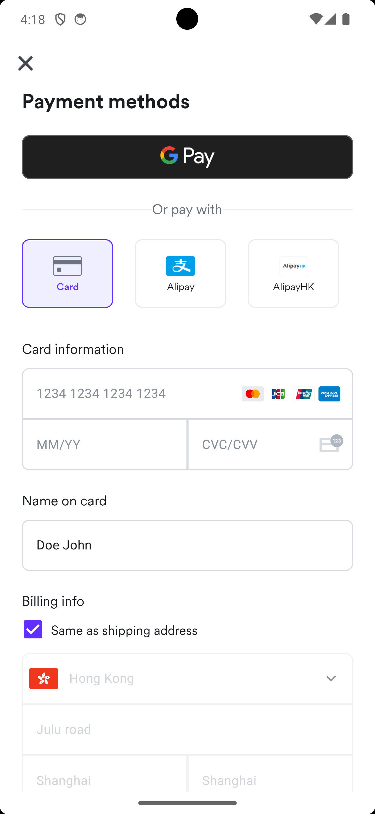
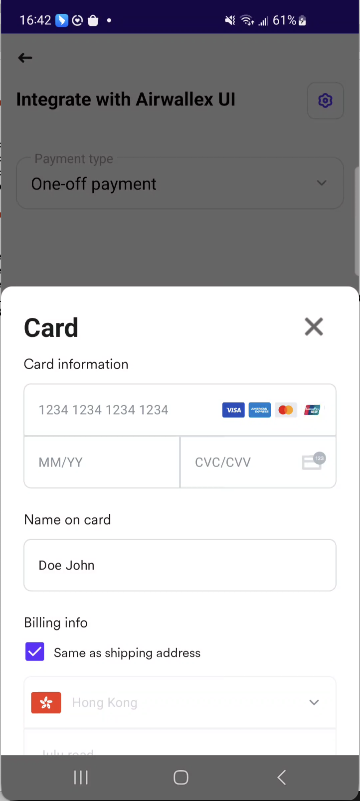
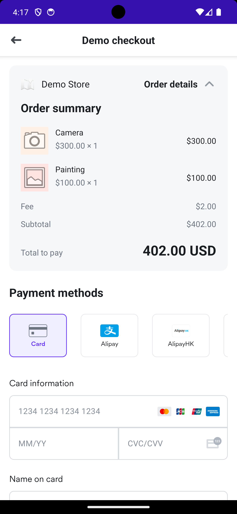
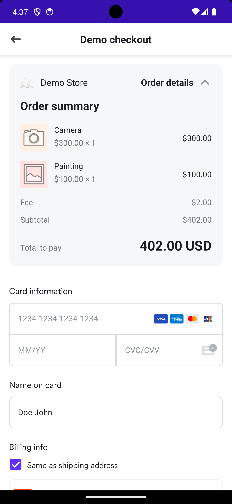
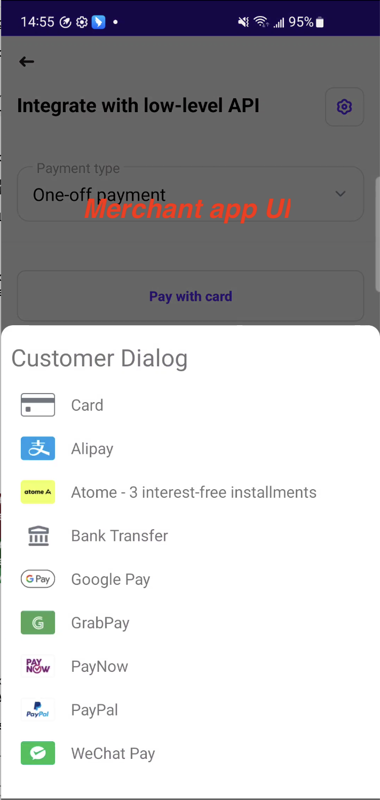
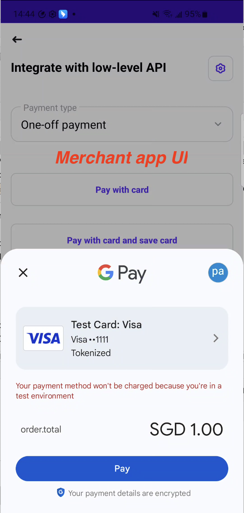
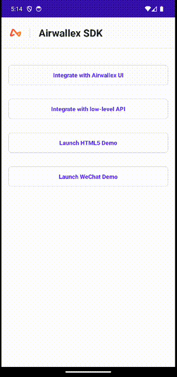

# Airwallex Android SDK
[](http://developer.android.com/index.html)
[](https://android-arsenal.com/api?level=21)
[](https://github.com/airwallex/airwallex-payment-android/releases)
[](https://github.com/airwallex/airwallex-payment-android/blob/develop/LICENSE)

[EN](./README.md) | 中文

## 目录

- [概述](#概述)
  - [支持的支付方式](#支持的支付方式)
  - [集成选项](#集成选项)
  - [示例应用](#示例应用)
  - [平台要求](#平台要求)
- [UI 集成 - 托管支付页面（HPP）](#ui-集成---托管支付页面hpp)
  - [安装 SDK](#安装-sdk)
  - [初始化](#sdk-配置)
  - [自定义外观](#自定义外观)
  - [支付流程](#支付流程)
  - [Google Pay 集成](#google-pay-集成)
- [UI 集成 - 嵌入式元素](#ui-集成---嵌入式元素)
  - [概述](#嵌入式概述)
  - [安装 SDK](#嵌入式安装-sdk)
  - [创建 PaymentElement](#创建-paymentelement)
  - [配置选项](#配置选项)
  - [Kotlin 示例](#kotlin-示例)
  - [Java 示例](#java-示例)
- [低层 API 集成](#低层-api-集成)
  - [SDK 安装](#步骤-1sdk-安装)
  - [配置及准备](#步骤-2配置及准备)
  - [创建 AirwallexSession 和 Airwallex 对象](#步骤-3创建-airwallexsession-和-airwallex-对象)
  - [可用 API](#可用-api)
      - [通过 Google Pay 发起支付](#通过-google-pay-发起支付)
      - [重定向支付](#重定向如支付宝hk)
      - [用卡和账单详情确认支付](#用卡和账单详情确认支付)
      - [用 Consent ID 确认支付](#用-consent-id-确认支付)
      - [用 PaymentConsent 确认支付](#用-paymentconsent-确认支付)
      - [获取支付方式列表](#获取支付方式列表)
      - [获取已保存卡列表](#获取已保存卡列表)
- [贡献与反馈](#贡献与反馈)

---

## 概述

Airwallex Android SDK 提供了一套完整的工具包，用于在 Android 应用中集成支付功能。它提供预构建 UI 组件以快速集成、可嵌入式元素以自定义外观，以及低层 API 以完全控制支付体验。

本指南涵盖 SDK 的安装、配置和集成。阅读本指南需要你熟悉 Android 开发、Android Studio 和 Gradle。

### 支持的支付方式

| 类别 | 支付方式 | 备注 |
|------|---------|------|
| 银行卡 | [`Visa, Mastercard, UnionPay, Discover, JCB, Diners Club`](#cards) | 使用低层 API 集成时需 PCI-DSS 合规 |
| Google Pay | [`Google Pay`](#google-pay-集成) | |
| 电子钱包 | [`支付宝`](#alipay)、[`支付宝HK`](#alipayhk)、[`DANA`](#dana)、[`GCash`](#gcash)、[`Kakao Pay`](#kakao-pay)、[`Touch 'n Go`](#touch-n-go)、[`微信支付`](#wechat-pay)，及[更多](https://www.airwallex.com/docs/payments/payment-methods/payment-methods-overview) | |

### 集成选项

请根据实际需求选择最合适的集成方式：

| 选项 | 说明 | 多种支付方式 | 单一支付方式 |
|------|------|-------------|-------------|
| [UI 集成 - 托管支付页面（HPP）](#ui-集成---托管支付页面hpp) | 启动完整的、由 SDK 管理的支付流程，提供预构建的支付方式选择、卡信息输入和结账页面。支持自定义主题色和深色模式。**推荐用于大多数场景。** |  |  |
| [UI 集成 - 嵌入式元素](#ui-集成---嵌入式元素) | 通过 Jetpack Compose 将 Airwallex 的 `PaymentElement` 直接嵌入到你的 Activity 或 View 中。你可以完全控制宿主布局和导航，同时利用 SDK 的支付 UI 组件。 |  |  |
| [低层 API 集成](#低层-api-集成) | 使用 SDK 的核心 API 构建完全自定义的支付 UI。可直接访问支付方式获取、卡片令牌化、支付确认和签约管理。卡支付需要 PCI-DSS 合规。 |  |  |

### 示例应用

完整的示例应用位于 [sample](sample) 目录中。该应用演示了如何使用 Airwallex Android SDK 的预构建 UI 组件管理结账流程，包括填写收货地址和选择支付方式。



运行示例应用：

1. 克隆项目到本地：
`git clone git@github.com:airwallex/airwallex-payment-android.git`

2. 打开 Android Studio，选择项目根目录下的 `build.gradle` 导入项目。

3. （可选）如需使用自己的 API 密钥进行测试，前往 [Airwallex Account settings > API keys](https://www.airwallex.com/app/settings/api)，将 `Client ID` 和 `API key` 填入 [`Settings.kt`](sample/src/main/java/com/airwallex/paymentacceptance/Settings.kt)：
```
    private const val API_KEY = replace_with_api_key
    private const val CLIENT_ID = replace_with_client_id
```

4. （可选）如需启用微信支付，在[微信支付](https://pay.weixin.qq.com/index.php/public/wechatpay)注册应用后，将 App ID 填入 [`Settings.kt`](sample/src/main/java/com/airwallex/paymentacceptance/Settings.kt)：
```
    private const val WECHAT_APP_ID = "put your WeChat app id here"
```

5. 运行 `sample` 工程。

测试时可使用 Airwallex 提供的[测试卡号](https://www.airwallex.com/docs/payments/test-and-go-live/test-card-numbers)。

### 平台要求

- Android API 21 (Lollipop) 及以上
- SDK 大小：约 3.1 MB

---

# UI 集成 - 托管支付页面（HPP）

### 安装 SDK

SDK 已发布至 [Maven Central](https://repo1.maven.org/maven2/io/github/airwallex/)

在 app 级 `build.gradle` 添加依赖：

```groovy
dependencies {
    // 必须
    implementation 'io.github.airwallex:payment:6.5.0'
    // 按需添加支付方式
    implementation 'io.github.airwallex:payment-card:6.5.0'
    implementation 'io.github.airwallex:payment-redirect:6.5.0'
    implementation 'io.github.airwallex:payment-wechat:6.5.0'
    implementation 'io.github.airwallex:payment-googlepay:6.5.0'
}
```

### 初始化

在 Application 类初始化 SDK：

```kotlin
AirwallexStarter.initialize(
    application,
    AirwallexConfiguration.Builder()
        .enableLogging(true)        // 生产环境请设为 false
        .saveLogToLocal(false)      // 如需自定义日志存储请设为 false
        .setEnvironment(environment)
        .setSupportComponentProviders(
            listOf(
                CardComponent.PROVIDER,
                WeChatComponent.PROVIDER,
                RedirectComponent.PROVIDER,
                GooglePayComponent.PROVIDER
            )
        )
        .build()
)
```

## 自定义外观

你可以自定义 Airwallex SDK UI 的外观，包括主题色和深色模式偏好设置。这适用于托管支付页面集成和嵌入式元素集成。

### 主题色和深色模式

使用 `PaymentAppearance` 配置支付 UI 外观：

**Kotlin:**
```kotlin
import com.airwallex.android.core.AirwallexConfiguration
import com.airwallex.android.core.PaymentAppearance

AirwallexStarter.initialize(
    application,
    AirwallexConfiguration.Builder()
        .enableLogging(true)
        .setEnvironment(environment)
        .setSupportComponentProviders(
            listOf(
                CardComponent.PROVIDER,
                RedirectComponent.PROVIDER,
                GooglePayComponent.PROVIDER
            )
        )
        .setPaymentAppearance(
            PaymentAppearance(
                themeColor = 0xFF612FFF.toInt(),  // 自定义主题色（ARGB 格式）
                isDarkTheme = true                 // 强制深色模式（true）、浅色模式（false）或跟随系统（null）
            )
        )
        .build()
)
```

**Java:**
```java
import com.airwallex.android.core.AirwallexConfiguration;
import com.airwallex.android.core.PaymentAppearance;

AirwallexStarter.initialize(
    application,
    new AirwallexConfiguration.Builder()
        .enableLogging(true)
        .setEnvironment(environment)
        .setSupportComponentProviders(
            Arrays.asList(
                CardComponent.PROVIDER,
                RedirectComponent.PROVIDER,
                GooglePayComponent.PROVIDER
            )
        )
        .setPaymentAppearance(
            new PaymentAppearance(
                0xFF612FFF,  // 自定义主题色（ARGB 格式）
                true         // 强制深色模式（true）、浅色模式（false）或跟随系统（null）
            )
        )
        .build()
);
```

**PaymentAppearance 选项：**
- `themeColor`：自定义主题色，ARGB 格式（如 `0xFF612FFF`）。如为 null，则使用默认 Airwallex 主题色。
- `isDarkTheme`：
  - `true` - 强制深色模式
  - `false` - 强制浅色模式
  - `null` - 跟随系统深色模式设置（默认）

### 传统主题覆盖

你也可以使用 Android 主题系统覆盖默认主题色：

```xml
<color name="airwallex_tint_color">@color/your_custom_color</color>
```

注意：推荐使用 `PaymentAppearance` 方式，因为它提供更多控制并且在所有 SDK UI 组件中保持一致。

### 支付流程

Airwallex Android SDK 支持两种支付流程：

1. **标准流程**：在展示支付 UI 前，先在服务端创建 PaymentIntent。这是传统方式，适用于支付金额和详情已确定的场景。

2. **Express Checkout（快速结账）**：提供 `PaymentIntentProvider` 或 `PaymentIntentSource`，在收集完用户支付详情后按需创建 PaymentIntent。适用于以下场景：
   - 希望减少前置服务端调用
   - 希望降低 PaymentIntent 过期风险，仅在用户主动进行支付时才创建
   - 希望避免为早期放弃结账流程的用户创建不必要的 PaymentIntent
   - 需要在支付时实时验证库存或商品可用性

两种流程都完全支持，你可以选择最适合你业务场景的方式。

#### 1. 创建 PaymentIntent（服务端）

对于**标准流程**，需要在展示支付 UI 前在服务端创建 PaymentIntent。

对于 **Express Checkout**，你将在 `PaymentIntentProvider` 或 `PaymentIntentSource` 实现中，当 SDK 请求时创建 PaymentIntent。

1. 获取 access token：用 Client ID 和 API key 调用认证 API（见 [API keys 设置](https://www.airwallex.com/app/settings/api)）
2. 创建客户（可选）：用 [`/api/v1/pa/customers/create`](https://www.airwallex.com/docs/api#/Payment_Acceptance/Customers/_api_v1_pa_customers_create/post)
3. 创建 PaymentIntent：用 [`/api/v1/pa/payment_intents/create`](https://www.airwallex.com/docs/api#/Payment_Acceptance/Payment_Intents/_api_v1_pa_payment_intents_create/post) 并获得 `client_secret`

#### 2. 创建 Airwallex Session

根据业务场景创建 session 对象。你可以选择两种方式：
- **标准流程**：预先在服务端创建 PaymentIntent，然后传给 SDK
- **Express Checkout**：提供 PaymentIntentProvider 在收集完支付详情后按需创建 PaymentIntent

##### 标准支付 Session

**标准流程**（预先创建 PaymentIntent）：
```kotlin
val paymentSession = AirwallexPaymentSession.Builder(
    paymentIntent = paymentIntent,
    countryCode = countryCode,
    googlePayOptions = googlePayOptions // 可选
)
    .setRequireBillingInformation(true)
    .setRequireEmail(requireEmail)
    .setReturnUrl(returnUrl)
    .setAutoCapture(autoCapture)
    .setHidePaymentConsents(false)
    .setPaymentMethods(listOf()) // 空列表表示所有可用方式
    .build()
```

**Express Checkout 流程**（按需创建 PaymentIntent）：
```kotlin
import com.airwallex.android.core.AirwallexPaymentSession
import com.airwallex.android.core.PaymentIntentProvider
import com.airwallex.android.core.PaymentIntentSource


// 方式 1：使用 PaymentIntentProvider（基于回调，兼容 Java）
class MyPaymentIntentProvider : PaymentIntentProvider {
    override val currency: String = "USD"
    override val amount: BigDecimal = 100.toBigDecimal()

    override fun provide(callback: PaymentIntentProvider.PaymentIntentCallback) {
        // 在需要时调用 API 创建 PaymentIntent
        myApiService.createPaymentIntent { result ->
            when (result) {
                is Success -> callback.onSuccess(result.paymentIntent)
                is Error -> callback.onError(result.exception)
            }
        }
    }
}

val provider = MyPaymentIntentProvider()
val session = AirwallexPaymentSession.Builder(
    paymentIntentProvider = provider,
    countryCode = countryCode,
    customerId = customerId, // 可选
    googlePayOptions = googlePayOptions // 可选
)
    .setRequireBillingInformation(true)
    .setRequireEmail(requireEmail)
    .setReturnUrl(returnUrl)
    .setAutoCapture(autoCapture)
    .setHidePaymentConsents(false)
    .setPaymentMethods(listOf())
    .build()


// 方式 2：使用 PaymentIntentSource（基于 suspend，推荐 Kotlin 使用）
class MyPaymentIntentSource : PaymentIntentSource {
    override val currency: String = "USD"
    override val amount: BigDecimal = 100.toBigDecimal()

    override suspend fun getPaymentIntent(): PaymentIntent {
        // 使用 suspend 函数调用 API
        return myApiService.createPaymentIntent()
    }
}

val source = MyPaymentIntentSource()
val session = AirwallexPaymentSession.Builder(
    paymentIntentSource = source,
    countryCode = countryCode,
    customerId = customerId, // 可选
    googlePayOptions = googlePayOptions // 可选
)
    .setRequireBillingInformation(true)
    .setRequireEmail(requireEmail)
    .setReturnUrl(returnUrl)
    .setAutoCapture(autoCapture)
    .setHidePaymentConsents(false)
    .setPaymentMethods(listOf())
    .build()
```

##### 循环支付 Session

```kotlin
val recurringSession = AirwallexRecurringSession.Builder(
    customerId = customerId,
    clientSecret = clientSecret,
    currency = currency,
    amount = amount,
    nextTriggerBy = nextTriggerBy,
    countryCode = countryCode
)
    .setRequireEmail(requireEmail)
    .setShipping(shipping)
    .setRequireCvc(requireCVC)
    .setMerchantTriggerReason(merchantTriggerReason)
    .setReturnUrl(returnUrl)
    .setPaymentMethods(listOf())
    .build()
```

##### 循环支付（带 Intent）Session

**标准流程**（预先创建 PaymentIntent）：
```kotlin
val recurringWithIntentSession = AirwallexRecurringWithIntentSession.Builder(
    paymentIntent = paymentIntent,
    customerId = customerId,
    nextTriggerBy = nextTriggerBy,
    countryCode = countryCode
)
    .setRequireEmail(requireEmail)
    .setRequireCvc(requireCVC)
    .setMerchantTriggerReason(merchantTriggerReason)
    .setReturnUrl(returnUrl)
    .setAutoCapture(autoCapture)
    .setPaymentMethods(listOf())
    .build()
```

**Express Checkout 流程**（按需创建 PaymentIntent）：
```kotlin
import com.airwallex.android.core.AirwallexRecurringWithIntentSession
import com.airwallex.android.core.PaymentIntentProvider
import com.airwallex.android.core.PaymentIntentSource


// 方式 1：使用 PaymentIntentProvider
val provider = MyPaymentIntentProvider() // 同上文的实现
val session = AirwallexRecurringWithIntentSession.Builder(
    paymentIntentProvider = provider,
    customerId = customerId,
    nextTriggerBy = nextTriggerBy,
    countryCode = countryCode
)
    .setRequireEmail(requireEmail)
    .setRequireCvc(requireCVC)
    .setMerchantTriggerReason(merchantTriggerReason)
    .setReturnUrl(returnUrl)
    .setAutoCapture(autoCapture)
    .setPaymentMethods(listOf())
    .build()


// 方式 2：使用 PaymentIntentSource（推荐 Kotlin 使用）
val source = MyPaymentIntentSource() // 同上文的实现
val session = AirwallexRecurringWithIntentSession.Builder(
    paymentIntentSource = source,
    customerId = customerId,
    nextTriggerBy = nextTriggerBy,
    countryCode = countryCode
)
    .setRequireEmail(requireEmail)
    .setRequireCvc(requireCVC)
    .setMerchantTriggerReason(merchantTriggerReason)
    .setReturnUrl(returnUrl)
    .setAutoCapture(autoCapture)
    .setPaymentMethods(listOf())
    .build()
```

#### 3. 展示支付 UI

##### 完整支付流程

```kotlin
AirwallexStarter.presentEntirePaymentFlow(
    activity = activity,
    session = session,
    paymentResultListener = object : Airwallex.PaymentResultListener { 
        override fun onCompleted(status: AirwallexPaymentStatus) {
            // 处理支付结果
        }
    }
)
```

##### 仅卡支付流程

```kotlin
AirwallexStarter.presentCardPaymentFlow(
    activity = activity,
    session = session,
    paymentResultListener = object : Airwallex.PaymentResultListener { 
        override fun onCompleted(status: AirwallexPaymentStatus) {
            // 处理支付结果
        }
    }
)
```

##### 卡支付弹窗

```kotlin
val dialog = AirwallexAddPaymentDialog(
    activity = activity,
    session = session,
    paymentResultListener = object : Airwallex.PaymentResultListener {
        override fun onCompleted(status: AirwallexPaymentStatus) {
            // 处理支付结果
        }
    }
)
dialog.show()
```

#### 4. 收货信息

允许用户填写收货信息：

```kotlin
AirwallexStarter.presentShippingFlow(
    activity = activity,
    shipping = shipping, // 可选
    shippingResultListener = object : Airwallex.ShippingResultListener {
        override fun onCompleted(status: AirwallexShippingStatus) {
            // 处理结果
        }
    }
)
```

#### 5. 校验支付状态

支付完成后校验状态：

```kotlin
airwallex.retrievePaymentIntent(
    params = RetrievePaymentIntentParams(
        paymentIntentId = paymentIntentId,
        clientSecret = clientSecret
    ),
    listener = object : Airwallex.PaymentListener<PaymentIntent> {
        override fun onSuccess(response: PaymentIntent) {
            // 成功回调
        }
        override fun onFailed(exception: AirwallexException) {
            Log.e(TAG, "获取 PaymentIntent 失败", exception)
        }
    }
)
```

### Google Pay 集成

#### 配置步骤

1. 确认你的 Airwallex 账号已开通 Google Pay
2. 安装 SDK 时按 [安装 SDK](#安装-sdk) 添加 Google Pay 模块

#### 自定义

可通过 `GooglePayOptions` 配置：

```kotlin
val googlePayOptions = GooglePayOptions(
    allowedCardAuthMethods = listOf("CRYPTOGRAM_3DS"),
    billingAddressParameters = BillingAddressParameters(BillingAddressParameters.Format.FULL),
    shippingAddressParameters = ShippingAddressParameters(listOf("AU", "CN"), true)
)
```

#### 支持卡类型

Google Pay 支持如下卡类型：
- AMEX
- DISCOVER
- JCB
- MASTERCARD
- VISA
- MAESTRO（仅当 `countryCode` 为 `BR`）

# UI 集成 - 嵌入式元素

Airwallex SDK 提供 `PaymentElement` - 一个灵活的组件，允许你将支付 UI 直接嵌入到自己的 activity 或 view 中。这让你可以完全控制宿主 UI，同时利用 Airwallex 预构建的支付组件。

## <a name="嵌入式概述"></a>概述

与托管支付页面集成中 SDK 启动自己的 activity（`PaymentMethodsActivity`、`AddPaymentActivity`）不同，嵌入式元素集成让你可以：
- 在自己的 activity/view 中嵌入支付 UI
- 控制周围的 UI 和布局
- 自定义容器样式
- 无缝集成到你的应用导航流程中

两种集成方式都支持通过 `PaymentAppearance` 进行相同的自定义选项（主题色和深色模式）。

## <a name="嵌入式安装-sdk"></a>安装 SDK

添加与托管支付页面集成相同的依赖：

```groovy
dependencies {
    // 核心模块（必需）
    implementation 'io.github.airwallex:payment:6.5.0'

    // 添加你想要支持的支付方式
    implementation 'io.github.airwallex:payment-card:6.5.0'
    implementation 'io.github.airwallex:payment-redirect:6.5.0'
    implementation 'io.github.airwallex:payment-wechat:6.5.0'
    implementation 'io.github.airwallex:payment-googlepay:6.5.0'
}
```

在 Application 类中配置 SDK（与托管支付页面集成相同 - 参见 [初始化](#sdk-配置)）。

## <a name="创建-paymentelement"></a>创建 PaymentElement

`PaymentElement.create()` 是一个 suspend 函数，用于初始化并获取支付 UI 所需的数据。你可以使用 `PaymentFlowListener` 接口或 lambda 回调。

两种方式都返回 `Result<PaymentElement>`，包含：
- `Success` - PaymentElement 实例
- `Failure` - 错误信息

## <a name="配置选项"></a>配置选项

使用 `PaymentElementConfiguration` 配置支付 UI：

### 1. 仅卡支付（`PaymentElementConfiguration.Card`）

仅显示卡输入和已保存的卡：

```kotlin
import com.airwallex.android.core.AirwallexSupportedCard

// 使用默认配置（所有支持的卡：Visa、Amex、Mastercard、Discover、JCB、Diners Club、UnionPay）
val configuration = PaymentElementConfiguration.Card()

// 或自定义支持的卡品牌
val customConfiguration = PaymentElementConfiguration.Card(
    supportedCardBrands = listOf(
        AirwallexSupportedCard.VISA,
        AirwallexSupportedCard.MASTERCARD
    )
)
```

**注意：** 默认情况下，`supportedCardBrands` 包含 `AirwallexSupportedCard` 中的所有卡（Visa、Amex、Mastercard、Discover、JCB、Diners Club、UnionPay）。你可以自定义此列表以限制接受哪些卡品牌。

### 2. 支付单（`PaymentElementConfiguration.PaymentSheet`）

以标签页或手风琴布局显示多种支付方式：

```kotlin
val configuration = PaymentElementConfiguration.PaymentSheet(
    layout = PaymentMethodsLayoutType.TAB,           // TAB 或 ACCORDION
    showsGooglePayAsPrimaryButton = true             // true: 将 Google Pay 显示为主按钮，false: 在列表中显示
)
```

**布局选项：**
- `PaymentMethodsLayoutType.TAB` - 支付方式的标签页布局
- `PaymentMethodsLayoutType.ACCORDION` - 支付方式的手风琴布局

**Google Pay 显示：**
- `showsGooglePayAsPrimaryButton = true` - Google Pay 显示为其他支付方式上方的突出按钮
- `showsGooglePayAsPrimaryButton = false` - Google Pay 与其他支付方式一起显示在列表中

## <a name="kotlin-示例"></a>Kotlin 示例

这是在你自己的 activity 中嵌入支付元素的完整示例：

```kotlin
import android.os.Bundle
import android.view.View
import androidx.activity.ComponentActivity
import androidx.lifecycle.lifecycleScope
import com.airwallex.android.core.Airwallex
import com.airwallex.android.core.AirwallexPaymentSession
import com.airwallex.android.core.AirwallexPaymentStatus
import com.airwallex.android.core.PaymentMethodsLayoutType
import com.airwallex.android.core.model.PaymentIntent
import com.airwallex.android.view.composables.PaymentElement
import com.airwallex.android.view.composables.PaymentElementConfiguration
import com.yourapp.databinding.ActivityCheckoutBinding
import kotlinx.coroutines.launch

class CheckoutActivity : ComponentActivity() {

    private lateinit var binding: ActivityCheckoutBinding
    private val airwallex: Airwallex by lazy { Airwallex(this) }

    override fun onCreate(savedInstanceState: Bundle?) {
        super.onCreate(savedInstanceState)
        binding = ActivityCheckoutBinding.inflate(layoutInflater)
        setContentView(binding.root)

        setupPaymentElement()
    }

    private fun setupPaymentElement() {
        // 显示加载指示器
        binding.progressBar.visibility = View.VISIBLE
        binding.composeView.visibility = View.GONE

        lifecycleScope.launch {
            // 创建 session（参见"创建 Airwallex Session"部分）
            val paymentIntent = PaymentIntent(
                id = "your_payment_intent_id",
                clientSecret = "your_client_secret",
                amount = 100.toBigDecimal(),
                currency = "USD"
            )

            val session = AirwallexPaymentSession.Builder(
                paymentIntent = paymentIntent,
                countryCode = "US"
            ).build()

            // 配置支付元素
            val configuration = PaymentElementConfiguration.PaymentSheet(
                layout = PaymentMethodsLayoutType.TAB,
                showsGooglePayAsPrimaryButton = true
            )

            // 创建 PaymentElement
            val result = PaymentElement.create(
                session = session,
                airwallex = airwallex,
                configuration = configuration,
                onLoadingStateChanged = { isLoading ->
                    // 可选：处理支付过程中的加载状态变化
                    binding.progressBar.visibility = if (isLoading) View.VISIBLE else View.GONE
                },
                onPaymentResult = { status ->
                    // 处理支付结果
                    when (status) {
                        is AirwallexPaymentStatus.Success -> {
                            // 支付成功
                            showSuccess(status.paymentIntentId)
                        }
                        is AirwallexPaymentStatus.Failure -> {
                            // 支付失败
                            showError(status.exception.message)
                        }
                        is AirwallexPaymentStatus.Cancel -> {
                            // 用户取消支付
                            showCancelled()
                        }
                        is AirwallexPaymentStatus.InProgress -> {
                            // 支付进行中（例如等待 3DS）
                            // 加载由 onLoadingStateChanged 处理
                        }
                    }
                },
                onError = { throwable ->
                    // 可选：处理元素初始化或支付过程中的错误
                    // 如果不提供，SDK 将显示默认错误对话框
                    showError(throwable.message)
                }
            )

            // 处理创建结果
            result.onSuccess { paymentElement ->
                // 隐藏加载，显示支付元素
                binding.progressBar.visibility = View.GONE
                binding.composeView.visibility = View.VISIBLE

                // 渲染支付 UI
                binding.composeView.setContent {
                    paymentElement.Content()
                }
            }.onFailure { throwable ->
                // 初始化支付元素失败
                binding.progressBar.visibility = View.GONE
                showError(throwable.message)
            }
        }
    }

    private fun showSuccess(paymentIntentId: String?) {
        // 显示成功 UI
    }

    private fun showError(message: String?) {
        // 显示错误 UI
    }

    private fun showCancelled() {
        // 处理取消
    }
}
```

**布局 XML (activity_checkout.xml)：**

```xml
<?xml version="1.0" encoding="utf-8"?>
<LinearLayout xmlns:android="http://schemas.android.com/apk/res/android"
    android:layout_width="match_parent"
    android:layout_height="match_parent"
    android:orientation="vertical"
    android:padding="16dp">

    <!-- 你的自定义 UI 元素 -->
    <TextView
        android:layout_width="wrap_content"
        android:layout_height="wrap_content"
        android:text="支付方式"
        android:textSize="20sp"
        android:textStyle="bold"
        android:layout_marginBottom="16dp" />

    <!-- 加载指示器 -->
    <ProgressBar
        android:id="@+id/progressBar"
        android:layout_width="wrap_content"
        android:layout_height="wrap_content"
        android:layout_gravity="center"
        android:visibility="gone" />

    <!-- PaymentElement 的 ComposeView -->
    <androidx.compose.ui.platform.ComposeView
        android:id="@+id/composeView"
        android:layout_width="match_parent"
        android:layout_height="wrap_content" />

</LinearLayout>
```

或者你可以查看我们示例应用中的 `EmbeddedElementActivity`。

## <a name="java-示例"></a>Java 示例

对于 Java 开发者，`PaymentElement` 提供了 Java 友好的静态方法，内部处理 Kotlin 协程，使用熟悉的两步模式：**创建** + **渲染**。

**完整实现参考：** 查看示例应用中的 `EmbeddedElementJavaActivity.java` 获取完整可运行的示例。

**核心集成代码：**

```java
import com.airwallex.android.view.composables.PaymentElement;
import com.airwallex.android.view.composables.PaymentElementCallback;
import com.airwallex.android.view.PaymentFlowListener;

// 配置支付元素
PaymentElementConfiguration configuration = new PaymentElementConfiguration.PaymentSheet(
    PaymentMethodsLayoutType.TAB,
    true  // showsGooglePayAsPrimaryButton
);

// 创建支付流程监听器以处理结果
PaymentFlowListener listener = new PaymentFlowListener() {
    @Override
    public void onPaymentResult(@NonNull AirwallexPaymentStatus status) {
        if (status instanceof AirwallexPaymentStatus.Success) {
            // 处理成功
        } else if (status instanceof AirwallexPaymentStatus.Failure) {
            // 处理失败
        }
    }
};

// 显示加载状态
binding.progressBar.setVisibility(View.VISIBLE);
binding.composeView.setVisibility(View.GONE);

// 步骤 1：创建 PaymentElement（内部处理协程）
PaymentElement.create(
    session,                 // AirwallexSession
    airwallex,               // Airwallex 实例
    configuration,           // PaymentElementConfiguration
    listener,                // PaymentFlowListener
    new PaymentElementCallback() {
        @Override
        public void onSuccess(@NonNull PaymentElement element) {
            // 隐藏加载状态
            binding.progressBar.setVisibility(View.GONE);
            binding.composeView.setVisibility(View.VISIBLE);

            // 步骤 2：在 ComposeView 中渲染 PaymentElement
            element.renderIn(binding.composeView);
        }

        @Override
        public void onFailure(@NonNull Throwable error) {
            // 隐藏加载状态并处理错误
            binding.progressBar.setVisibility(View.GONE);
            showError(error.getMessage());
        }
    }
);
```

**Java 集成优势：**
- 内部处理 Kotlin 协程（无需处理 suspend 函数互操作）
- 使用 Java 开发者熟悉的回调模式
- 分离创建和渲染，提供最大灵活性
- 你可以控制何时以及如何显示加载状态
- 支持支付表单和仅卡片两种模式

**两步模式：**
1. **`PaymentElement.create()`** - 创建并初始化元素（异步操作）
2. **`element.renderIn()`** - 在你的 ComposeView 中渲染 UI（在成功回调中调用）

**注意：** 虽然完全支持 Java 集成，但我们建议使用 Kotlin 以获得嵌入式元素的最佳开发体验。

**与托管支付页面集成的主要区别：**

| 功能 | 托管支付页面集成 | 嵌入式元素集成 |
|------|------------|---------------|
| 入口点 | `AirwallexStarter.presentPaymentFlow()` | `PaymentElement.create()` |
| Activity 所有权 | SDK 拥有 activity | 你拥有 activity |
| UI 容器 | SDK 的 activity | 你的 ComposeView |
| 布局控制 | 有限（SDK 控制） | 完全（你控制周围 UI） |
| 初始化 | 启动 activity | Suspend 函数 |
| 回调 | `AirwallexCheckoutListener` | `PaymentFlowListener` 或 lambda |

---

# 低层 API 集成

你可以基于低层 API 完全自定义 UI。

## 步骤 1：SDK 安装

SDK 支持 Android API 21 及以上。

在 app 级 `build.gradle` 添加依赖：

```groovy
dependencies {
    // 必须
    implementation 'io.github.airwallex:payment-components-core:6.5.0'
    // 按需添加支付方式
    implementation 'io.github.airwallex:payment-card:6.5.0'
    implementation 'io.github.airwallex:payment-googlepay:6.5.0'
    implementation 'io.github.airwallex:payment-redirect:6.5.0'
}
```

## 步骤 2：配置及准备

初始化 SDK：

```kotlin
Airwallex.initialize(
    this,
    AirwallexConfiguration.Builder()
        .enableLogging(true) // 生产环境建议为 false
        .saveLogToLocal(false)
        .setEnvironment(environment)
        .setSupportComponentProviders(
            listOf(
                CardComponent.PROVIDER,
                WeChatComponent.PROVIDER,
                RedirectComponent.PROVIDER,
                GooglePayComponent.PROVIDER
            )
        )
        .build()
)
```

服务端需提前创建 PaymentIntent，详见 [支付流程](#支付流程)。

## 步骤 3：创建 AirwallexSession 和 Airwallex 对象

创建 AirwallexSession 参考上文，创建 Airwallex 对象如下：

```kotlin
val airwallex = Airwallex(activity)
```

## 可用 API

以下 API 可根据你的支付场景独立使用，它们不是需要依次执行的顺序步骤。

### 通过 Google Pay 发起支付

请先完成 [Google Pay 配置](#google-pay-集成)

```kotlin
airwallex.startGooglePay(
    session = session,
    listener = object : Airwallex.PaymentResultListener {
        override fun onCompleted(status: AirwallexPaymentStatus) {
            // 处理不同支付状态
        }
    }
)
```

### 重定向（如支付宝HK）

```kotlin
airwallex.startRedirectPay(
    session = session,
    paymentType = "alipayhk",
    listener = object : Airwallex.PaymentResultListener {
        override fun onCompleted(status: AirwallexPaymentStatus) {
            // 处理不同支付状态
        }
    }
)
```

### 用卡和账单详情确认支付

```kotlin
airwallex.confirmPaymentIntent(
    session = session,
    card = PaymentMethod.Card.Builder()
        .setNumber("4012000300000021")
        .setName("John Citizen")
        .setExpiryMonth("12")
        .setExpiryYear("2029")
        .setCvc("737")
        .build(),
    billing = null,
    saveCard = false,
    listener = object : Airwallex.PaymentResultListener {
        override fun onCompleted(status: AirwallexPaymentStatus) {
            // 处理不同支付状态
        }
    }
)
```

### 用 Consent ID 确认支付

```kotlin
airwallex.confirmPaymentIntent(
    session = session,
    paymentConsentId = "cst_xxxxxxxxxx",
    listener = object : Airwallex.PaymentResultListener {
        override fun onCompleted(status: AirwallexPaymentStatus) {
            // 处理不同支付状态
        }
    }
)
```

### 用 PaymentConsent 确认支付

```kotlin
airwallex.confirmPaymentIntent(
    session = session,
    paymentConsent = paymentConsent,
    listener = object : Airwallex.PaymentResultListener {
        override fun onCompleted(status: AirwallexPaymentStatus) {
            // 处理不同支付状态
        }
    }
)
```

### 获取支付方式列表

```kotlin
val methods = airwallex.retrieveAvailablePaymentMethods(
    session = session,
    params = RetrieveAvailablePaymentMethodParams.Builder(
        clientSecret = getClientSecretFromSession(session),
        pageNum = 1
    )
    .setActive(true)
    .setTransactionCurrency(session.currency)
    .setCountryCode(session.countryCode)
    .build()
)
```

### 获取已保存卡列表

```kotlin
val consents = airwallex.retrieveAvailablePaymentConsents(
    RetrieveAvailablePaymentConsentsParams.Builder(
        clientSecret = clientSecret,
        customerId = customerId,
        pageNum = 1
    )
    .setNextTriggeredBy(nextTriggerBy)
    .setStatus(PaymentConsent.PaymentConsentStatus.VERIFIED)
    .build()
)
```

---

## 贡献与反馈

欢迎任何形式的贡献，包括新功能、bug 修复和文档改进。同时也感谢您使用 Airwallex Android SDK 并提供反馈。

以下是几种联系方式：

* 对于一般适用的问题和反馈，可以直接在[`Issues`](https://github.com/airwallex/airwallex-payment-android/issues)中提交问题。
* [pa_mobile_sdk@airwallex.com](mailto:pa_mobile_sdk@airwallex.com) - 也可以发送问题到这个邮箱，我们会尽快提供帮助。
